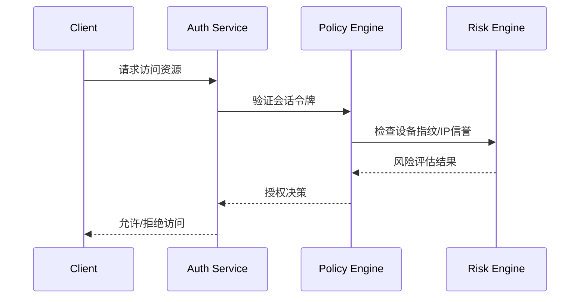

# Cookie伪造登录漏洞防御指南

## 1. 漏洞核心原理
Cookie伪造登录漏洞源于攻击者通过篡改、预测或窃取会话凭证，绕过身份验证机制访问用户账户。其典型攻击路径包括：
- 明文Cookie传输导致中间人截取
- 弱会话ID生成算法被暴力破解
- XSS攻击窃取有效Cookie
- 会话固定攻击强制用户使用已知会话ID

## 2. 核心防御策略（深度防护体系）

### 2.1 强化Cookie安全属性
| 属性        | 配置要求                          | 防护作用                     |
|-------------|-----------------------------------|------------------------------|
| HttpOnly    | 默认启用                          | 阻止XSS脚本读取Cookie        |
| Secure      | 全站HTTPS时强制启用               | 防止明文传输中的Cookie泄露   |
| SameSite    | Strict/Lax模式（根据业务场景选择）| 防御CSRF引发的Cookie滥用      |
| Path        | 精确限定到必需路径                | 降低横向越权风险            |

**实现示例（Node.js）：**
```javascript
res.cookie('sessionID', token, {
  httpOnly: true,
  secure: true,
  sameSite: 'Strict',
  path: '/user',
  maxAge: 3600000,
  domain: '.example.com'
});
```

### 2.2 会话令牌安全增强
1. **高强度令牌生成**
   - 使用加密安全的随机数生成器（CSPRNG）
   - 推荐长度≥128位（如SHA-256哈希输出）
   - 包含服务器端签名（HMAC）

2. **动态绑定验证机制**
   ```python
   # Python示例：会话令牌绑定验证
   def generate_secure_token(user_id):
       timestamp = int(time.time())
       nonce = secrets.token_hex(16)
       signature = hmac.new(SECRET_KEY, f"{user_id}|{timestamp}|{nonce}".encode(), 'sha256').hexdigest()
       return f"{user_id}.{timestamp}.{nonce}.{signature}"
   ```

3. **多维度绑定校验**
   - 客户端指纹（User-Agent+IP哈希）
   - 地理位置异常检测
   - 设备指纹验证

### 2.3 加密传输与存储
1. **传输层防护**
   - 强制全站HTTPS（HSTS头配置）
   - 启用HTTP/2协议及TLS1.3

2. **存储加密策略**
   ```java
   // Java AES-GCM加密示例
   Cipher cipher = Cipher.getInstance("AES/GCM/NoPadding");
   cipher.init(Cipher.ENCRYPT_MODE, secretKey, new GCMParameterSpec(128, iv));
   byte[] encrypted = cipher.doFinal(cookieValue.getBytes(StandardCharsets.UTF_8));
   ```

### 2.4 会话生命周期管理
1. **超时策略**
   - 活动会话：30分钟无操作失效
   - 绝对超时：最大存活时间≤24小时
   - 敏感操作后立即刷新令牌

2. **令牌撤销机制**
   ```sql
   -- 数据库撤销列表示例
   CREATE TABLE revoked_tokens (
     token_hash CHAR(64) PRIMARY KEY,
     revoke_time DATETIME DEFAULT CURRENT_TIMESTAMP
   );
   ```

### 2.5 实时监控与防护
1. **异常检测规则**
   - 同一用户并发会话数≥3时触发警报
   - 跨地域登录时间差<1小时的异常访问
   - 失效Cookie重复使用频率阈值

2. **防御层集成**
   - WAF规则配置：
     ```nginx
     # Nginx防御规则示例
     location / {
         set $cookie_check "";
         if ($http_cookie ~* "sessionID=([^;]+)(;|$)") {
             set $cookie_check $1;
         }
         if ($cookie_check !~ "^[a-f0-9]{64}$") {
             return 403;
         }
     }
     ```

### 2.6 开发规范要求
1. **禁止的实践**
   - 在URL参数中传递会话标识
   - 使用可逆加密存储敏感数据
   - 基于客户端输入直接生成会话ID

2. **代码审查重点**
   - 所有Cookie操作必须包含安全标记
   - 会话令牌与业务逻辑解耦
   - 注销接口必须清除服务器端会话记录

## 3. 进阶防护方案

### 3.1 令牌绑定技术
```javascript
// 浏览器指纹生成示例
const fingerprint = CryptoJS.SHA256(
  navigator.userAgent +
  screen.colorDepth +
  new Date().getTimezoneOffset()
).toString();
```

### 3.2 动态令牌更新
- 每次敏感操作后生成新令牌
- 保留旧令牌5秒防止并发请求失败

### 3.3 零信任验证架构


## 4. 验证与测试方案
1. **自动化检测方法**
   ```bash
   # OWASP ZAP测试命令
   zap-cli --key=api-license active-scan -s xss,sqli -u https://example.com
   ```

2. **渗透测试用例**
   - 修改Cookie中的用户ID参数
   - 重放已注销会话的Cookie
   - 跨用户Cookie注入尝试

3. **审计指标**
   - Cookie安全头覆盖率 ≥98%
   - 会话劫持检测平均响应时间 <500ms
   - 异常登录阻断率 ≥95%

## 5. 应急响应流程
1. **事件识别**
   - 监控会话并发异常
   - 审计日志中的Cookie篡改记录

2. **即时处置**
   ```sql
   -- 批量撤销受影响令牌
   INSERT INTO revoked_tokens (token_hash)
   SELECT SHA2(session_token, 256)
   FROM active_sessions
   WHERE user_id = :compromised_user;
   ```

3. **事后追溯**
   - 分析被盗Cookie的生成时间和来源IP
   - 检查服务器日志中的异常验证请求

本指南遵循OWASP ASVS v4.0标准，建议每季度进行策略复审更新。防御措施需根据业务场景组合实施，构建覆盖全生命周期的防护体系。

---

*文档生成时间: 2025-03-12 17:55:27*
