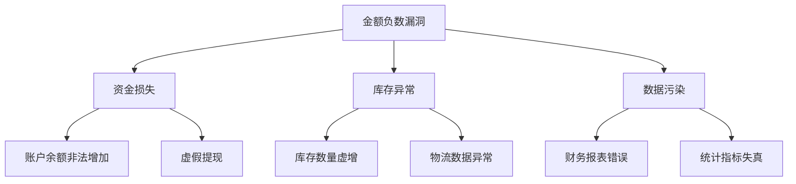

```markdown
# 订单金额负数篡改漏洞深度剖析

## 1. 漏洞定义与核心原理
### 1.1 基本定义
订单金额负数篡改漏洞（Negative Value Manipulation Vulnerability）是指攻击者通过修改交易系统中的金额参数为负数，导致业务逻辑异常或非法获利的Web安全漏洞。该漏洞属于业务逻辑漏洞范畴，在电商、金融支付、虚拟交易等系统中具有高危险性。

### 1.2 核心攻击原理
攻击者通过以下技术路径实施攻击：
1. 拦截或构造包含金额参数的HTTP请求
2. 将数值型参数篡改为负数（如-100.00）
3. 利用系统未正确校验负数的业务逻辑缺陷：
   - 订单总额计算异常（总金额=商品价格×负数数量）
   - 账户余额异常增加（充值金额为负数时等效于提现）
   - 库存数量异常变动（退货操作中负数数量导致库存增加）

### 1.3 数学表达模型
设原始金额为$P$，篡改后金额为$P'$，则存在：
$$ P' = 
\begin{cases}
P \times k & \text{(比例篡改)} \\
P + \Delta & \text{(增量篡改)} \\
-P & \text{(符号翻转)}
\end{cases} $$
其中符号翻转攻击危害最大且最易实现

## 2. 漏洞分类与技术特征
### 2.1 按攻击入口分类
| 类型                | 典型场景                         | 技术特征                     |
|---------------------|----------------------------------|-----------------------------|
| 前端参数篡改        | 浏览器端JavaScript验证绕过       | 修改HTML表单字段或API请求参数|
| API参数注入         | 未加密的RESTful API请求          | 直接修改JSON/XML中的数值字段|
| 批量操作漏洞        | 购物车批量编辑功能               | 使用负数实现批量价格覆盖     |
| 事务处理缺陷        | 支付与退款流程耦合               | 利用负数金额触发逆向资金流  |

### 2.2 按业务影响分类


## 3. 技术实现细节
### 3.1 典型攻击流程
```python
# 伪代码示例：存在漏洞的订单处理逻辑
def create_order(request):
    product_id = request.POST.get('product_id')
    quantity = int(request.POST.get('quantity'))  # 未校验数值范围
    price = Product.objects.get(id=product_id).price
    
    # 漏洞点：直接使用用户传入的数值进行计算
    total = price * quantity
    Order.objects.create(product_id=product_id, 
                       quantity=quantity,
                       total_price=total)
```

### 3.2 常见参数篡改点
1. HTTP请求参数：
   ```http
   POST /checkout HTTP/1.1
   Content-Type: application/x-www-form-urlencoded
   
   product_id=123&quantity=-5&coupon=100%OFF
   ```
2. JSON API请求：
   ```json
   {
     "items": [
       {"sku": "A001", "qty": -3, "price": 199.00}
     ]
   }
   ```
3. GraphQL查询：
   ```graphql
   mutation {
     applyCredit(input: {
       userId: "123", 
       amount: "-100.00"  # 字符串类型数值注入
     }) 
   }
   ```

### 3.3 高级绕过技巧
1. 科学计数法注入：
   ```text
   -1e3 => -1000
   2.5e-2 => 0.025
   ```
2. 字符串拼接攻击：
   ```javascript
   // 前端显示$100，实际提交"-100"
   document.getElementById('amount').value = "-" + originalValue; 
   ```
3. 精度溢出攻击：
   ```python
   # 利用浮点数精度问题
   float_amount = -sys.float_info.max * 0.999
   ```

## 4. 攻击向量案例分析
### 4.1 电商平台优惠券组合攻击
**攻击步骤：**
1. 选择高价值商品（如$1000的电子产品）
2. 应用合法优惠券（如$100 OFF）
3. 篡改优惠券金额为$-1000
4. 触发计算：$1000 - (-1000) = $2000余额

**数学表达：**
$$ Final = P - (C \times k) $$
当攻击者设置$k=-10$时，实际优惠变为$C \times (-10)$

### 4.2 金融系统充值提现漏洞
**漏洞代码示例：**
```java
public void handleTransaction(User user, BigDecimal amount) {
    user.setBalance(user.getBalance().add(amount)); // 直接累加未校验符号
    transactionDao.save(new Transaction(user, amount));
}
```
攻击者传入amount=-5000时，用户余额增加5000单位

## 5. 防御策略与解决方案
### 5.1 分层防御体系


### 5.2 关键技术措施
1. 输入验证规范：
   ```python
   def validate_amount(value):
       if not isinstance(value, (int, float)):
           raise ValidationError("Invalid data type")
       if value <= 0:
           raise ValidationError("Value must be positive")
       if abs(value) > sys.maxsize // 1000:
           raise ValidationError("Value exceeds maximum limit")
   ```
   
2. 服务端业务规则校验：
   ```java
   public void processOrder(Order order) {
       if (order.getQuantity() <= 0) {
           throw new BusinessException("Invalid quantity");
       }
       if (order.getTotal().compareTo(BigDecimal.ZERO) <= 0) {
           throw new BusinessException("Invalid total amount");
       }
       // 幂等性校验
       if (orderRepository.existsByRequestId(order.getRequestId())) {
           throw new BusinessException("Duplicate request");
       }
   }
   ```

3. 签名校验机制：
   ```javascript
   // HMAC-SHA256参数签名示例
   const crypto = require('crypto');
   
   function signParams(params, secret) {
     const str = Object.keys(params)
       .sort()
       .map(k => `${k}=${params[k]}`)
       .join('&');
     return crypto.createHmac('sha256', secret)
       .update(str)
       .digest('hex');
   }
   ```

### 5.3 监控与审计建议
1. 异常金额阈值告警：
   ```sql
   -- 实时监控异常交易
   SELECT * FROM transactions 
   WHERE amount < 0 
     AND transaction_type = 'PAYMENT'
   LIMIT 100;
   ```
   
2. 业务操作日志记录：
   ```python
   class TransactionLogger:
       def log(self, user, action, detail):
           entry = {
               'timestamp': datetime.utcnow(),
               'user_id': user.id,
               'ip': request.remote_addr,
               'user_agent': request.headers.get('User-Agent'),
               'action': action,
               'detail': json.dumps(detail)
           }
           audit_log.insert_one(entry)
   ```

## 6. 结语
订单金额负数篡改漏洞揭示了现代Web系统中业务逻辑安全的脆弱性。防御需要建立从数据输入到持久化存储的全链路校验机制，结合密码学签名、业务规则验证和实时监控的多层防护体系。建议企业定期进行以下安全实践：

1. 业务逻辑专项审计（每年至少2次）
2. 关键交易接口的模糊测试
3. 金额类参数的突变测试（Mutation Testing）
4. 建立负值测试用例库
5. 实施运行时应用自我保护（RASP）

通过持续的安全加固和攻击模拟，可有效防御此类业务逻辑漏洞，保障交易系统的完整性与可靠性。
```

---

*文档生成时间: 2025-03-12 19:52:12*
