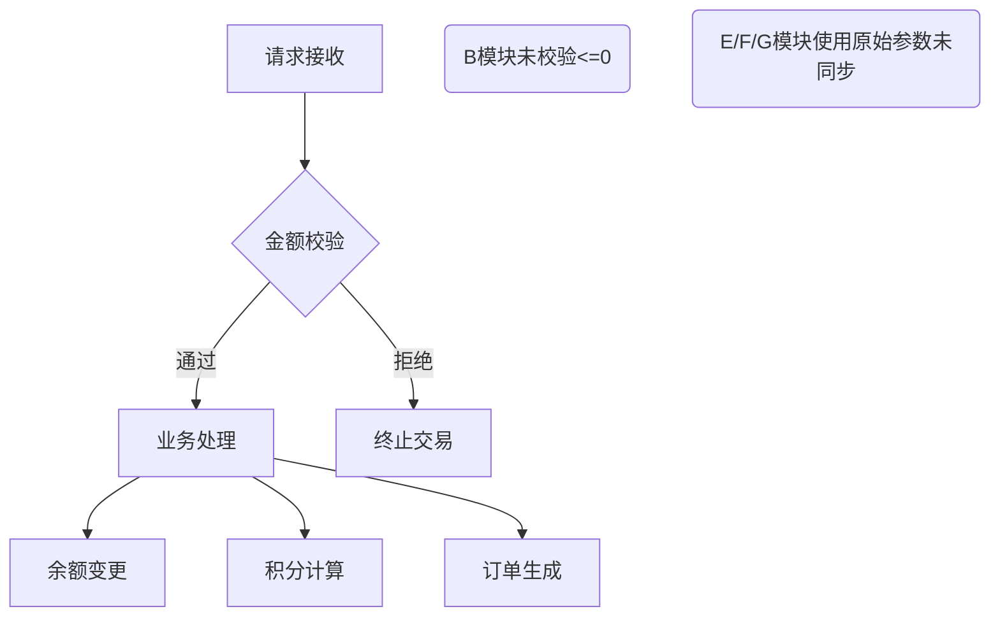

# 订单金额负数篡改的案例分析

## 1. 漏洞原理概述
订单金额负数篡改是一种典型的业务逻辑漏洞，攻击者通过修改交易请求中的金额参数为负值，利用系统对金额校验的缺失或业务逻辑缺陷，实现非法获利。其核心成因包括：
- **前端依赖信任**：仅依赖前端验证而未在服务端实施双重校验
- **事务原子性缺失**：未正确处理多笔关联交易的金额合计校验
- **数值范围漏洞**：未对金额参数进行有效边界限制（如允许负值输入）
- **业务规则冲突**：优惠计算与金额校验存在执行顺序错误

## 2. 典型攻击案例剖析

### 2.1 电商平台"零元购"事件（2018）
某头部电商平台因未校验订单总金额下限，攻击者通过以下步骤实现零成本购物：
1. 选择高价值商品加入购物车
2. 拦截支付请求修改`total_amount`参数为-9999
3. 叠加使用平台优惠券（面值100元）
4. 系统计算：-9999 + 100 = -9899 → 最终支付金额归零
5. 成功生成待发货订单

**技术细节**：
- 优惠计算模块在金额校验前执行
- 未建立金额变动追踪机制
- 订单状态机允许负金额订单进入发货流程

### 2.2 游戏充值负金额刷积分（2020）
某手游平台遭遇的典型攻击链：
```
POST /recharge  HTTP/1.1
{
    "user_id": "12345",
    "amount": -1000,  // 篡改参数
    "currency": "CNY"
}
```
**攻击效果**：
- 账户余额增加1000游戏币（系统执行`balance += abs(amount)`）
- 消费积分同步增加（按原始参数计算`points += amount`）

**漏洞成因**：
- 金额绝对值运算与积分计算分离
- 未建立充值金额与积分获取的关联验证
- 未记录原始交易参数供审计

### 2.3 金融系统对冲套现（2021）
某P2P平台资金对冲漏洞：
```python
# 缺陷代码示例
def transfer(sender, receiver, amount):
    if amount > sender.balance:
        return error
    sender.balance -= amount
    receiver.balance += amount  # 接收端未校验金额正负
```
**攻击模式**：
1. 用户A发起转账-50000给用户B
2. 用户A账户余额增加50000（`-= -50000`）
3. 用户B账户扣除50000（`+= -50000`）
4. 通过多账户循环操作实现资金无限放大

## 3. 技术实现细节

### 3.1 参数篡改切入点
| 攻击层面       | 具体方法                          | 典型载荷                   |
|----------------|-----------------------------------|---------------------------|
| 前端表单       | 修改disabled属性/解除JS验证       | `document.getElementById('amount').removeAttribute('disabled')` |
| API请求        | 中间人拦截修改JSON/XML数据        | `{"amount": -299.00}`     |
| 批量操作       | 在CSV导入中插入负值记录           | `订单ID,用户A,-1500`      |
| 关联业务       | 利用退款与支付的逻辑耦合          | 支付-100后立即申请退款+100 |

### 3.2 系统缺陷模式


### 3.3 高级绕过技术
- **科学计数法注入**：`1e-5` → 0.00001
- **溢出攻击**：`-2147483648`（32位整数最小值）
- **多阶段攻击**：
  1. 正常支付+100生成订单
  2. 修改订单金额为-100
  3. 申请退款触发`原路退回abs(amount)`

## 4. 防御方案设计

### 4.1 分层防护体系
```python
# 服务端校验示例（Python）
def validate_amount(amount):
    # 类型校验
    if not isinstance(amount, (int, float)):
        raise InvalidTypeError
    # 范围校验
    if amount <= 0 or amount > 1000000:
        raise OutOfRangeError
    # 精度校验
    if abs(amount - round(amount, 2)) > 1e-6:
        raise PrecisionError
    # 业务规则校验
    if current_user.balance + amount < 0:
        raise BalanceInsufficientError
    return round(amount, 2)
```

### 4.2 关键防御措施
1. **数据完整性验证**
   - 使用HMAC签名：`sign = HMAC-SHA256(api_key, concat(amount,currency,timestamp))`
   - 字段级加密：对金额字段进行AES-GCM加密

2. **事务处理规范**
   ```sql
   BEGIN TRANSACTION;
   UPDATE accounts SET balance = balance - :amount WHERE user_id = :sender;
   UPDATE accounts SET balance = balance + :amount WHERE user_id = :receiver;
   INSERT INTO transactions (sender, receiver, amount) VALUES (:sender, :receiver, ABS(:amount));
   COMMIT;
   ```

3. **监控审计机制**
   - 实时检测规则：
     ```javascript
     // 金额突变检测
     if (Math.abs(currentAmount - previousAmount) > threshold) {
         triggerAlert('AMOUNT_ABNORMAL_CHANGE');
     }
     ```
   - 审计日志字段：
     ```
     original_amount: 100.00
     modified_amount: -100.00
     operator_ip: 192.168.1.100
     request_signature: 7a3b...cdef
     ```

## 5. 行业实践参考
1. OWASP ASVS标准：
   - V5.3.4 验证所有数值参数均在业务允许范围内
   - V3.6.1 确保关键业务流包含完整性校验

2. PCI DSS要求：
   - 需求 6.3.2 对支付金额变更操作实施双重审批
   - 需求 10.2.1 记录所有金额字段的修改前/后值

3. 金融行业规范：
   - 遵循《JR/T 0173-2020》第7.3条：支付系统必须实现金额双向校验
   - 执行《银联卡业务安全规范》6.2.4：交易金额必须通过3DES加密传输

本案例分析表明，防御订单金额篡改需要建立从前端展示到数据库存储的全链路校验机制，结合业务场景设计多层级防护策略，并通过持续监控确保系统对异常金额操作的快速响应能力。

---

*文档生成时间: 2025-03-12 20:13:40*
