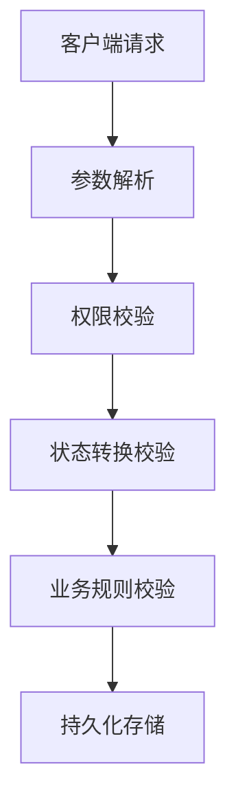

```markdown
# 订单状态机完整性验证技术深度解析

## 1. 定义与核心概念
### 1.1 状态机基础
订单状态机（Order State Machine）是电子商务系统中的关键组件，它定义了订单生命周期中允许的状态集合（如：待支付、已支付、已发货、已完成、已取消等）以及状态之间的合法转换规则。其完整性验证指确保状态转换过程严格遵循预设的业务逻辑，防止非法状态跃迁。

### 1.2 完整性威胁场景
攻击者可能通过以下方式破坏状态机完整性：
- 绕过前置校验直接修改数据库状态字段
- 利用并发请求导致状态竞态条件
- 篡改客户端传入的状态参数
- 调用未受保护的后端API端点

## 2. 技术原理剖析
### 2.1 状态转换验证模型
有效状态机应实现：
```
Current State + Event + Conditions → New State
```
其中：
- Event：触发状态转换的操作（如支付成功、发货操作）
- Conditions：转换前提条件（如库存充足、支付验证通过）

### 2.2 验证层级架构


## 3. 攻击向量分类
### 3.1 直接状态篡改
**示例漏洞代码：**
```python
# 危险的不安全状态更新
@app.route('/update_order_status', methods=['POST'])
def update_status():
    new_status = request.form['status']
    Order.query.filter_by(id=request.form['order_id']).update({'status': new_status})
    return "Status updated"
```

**攻击方式：**
通过构造POST请求直接将状态从"待支付"修改为"已发货"

### 3.2 状态跳跃攻击
利用缺失的中间状态校验：
```
待支付 → 已发货（跳过已支付状态）
```

### 3.3 逆向操作攻击
执行非法逆向状态转换：
```
已完成 → 已发货 → 已支付 → 待支付
```

### 3.4 并发竞争攻击
```python
# 存在竞态条件的库存扣减
def handle_payment(order_id):
    order = Order.get(order_id)
    if order.status == '待支付':
        process_payment()
        order.status = '已支付'  # 可能被并发请求覆盖
```

## 4. 关键防御技术实现
### 4.1 状态转换矩阵设计
**状态转换表示例：**

当前状态 | 允许操作 | 目标状态 | 前置条件
---|---|---|---
待支付 | 支付成功 | 已支付 | 支付金额校验通过
已支付 | 发货 | 已发货 | 库存充足且地址有效
已发货 | 确认收货 | 已完成 | 物流签收时间<3天

### 4.2 服务端验证层实现
**Python示例：**
```python
class OrderStateMachine:
    transitions = {
        '待支付': {'pay_success': '已支付'},
        '已支付': {'ship': '已发货'},
        '已发货': {'confirm': '已完成'}
    }

    @classmethod
    def validate_transition(cls, current_state, action):
        if action not in cls.transitions.get(current_state, {}):
            raise InvalidStateTransition(
                f"Illegal transition from {current_state} via {action}")
        return cls.transitions[current_state][action]

# 在视图层应用验证
@app.route('/update_order', methods=['POST'])
@auth_required
def update_order():
    order = get_current_order()
    new_status = OrderStateMachine.validate_transition(
        order.status, request.json['action'])
    order.update_status(new_status)
```

### 4.3 数据库层防护
**使用CHECK约束（PostgreSQL示例）：**
```sql
CREATE TYPE order_status AS ENUM (
    '待支付', '已支付', '已发货', '已完成', '已取消'
);

CREATE TABLE orders (
    id SERIAL PRIMARY KEY,
    status order_status NOT NULL DEFAULT '待支付',
    CHECK (
        (status = '待支付') OR
        (status = '已支付' AND payment_id IS NOT NULL) OR
        (status = '已发货' AND shipping_id IS NOT NULL)
    )
);
```

### 4.4 分布式锁机制
```java
// Redis分布式锁示例
public boolean tryUpdateStatus(String orderId, OrderStatus newStatus) {
    String lockKey = "order_lock:" + orderId;
    String lockId = UUID.randomUUID().toString();
    
    try {
        // 获取分布式锁
        boolean locked = redis.setnx(lockKey, lockId, Duration.ofSeconds(30));
        if (!locked) throw new ConcurrentModificationException();
        
        Order order = orderRepository.findById(orderId);
        if (order.isValidTransition(newStatus)) {
            order.setStatus(newStatus);
            orderRepository.save(order);
            return true;
        }
        return false;
    } finally {
        // 释放锁
        if (lockId.equals(redis.get(lockKey))) {
            redis.del(lockKey);
        }
    }
}
```

## 5. 高级攻击场景防御
### 5.1 时间窗口攻击防护
**版本号乐观锁实现：**
```sql
UPDATE orders 
SET status = '已支付', version = version + 1 
WHERE id = 123 AND version = 5
```

### 5.2 批量操作漏洞
**不安全的批量更新：**
```http
POST /api/orders/bulk_update
{"status": "已取消", "ids": [1,2,3]}
```

**防御方案：**
- 对每个订单ID单独执行状态校验
- 限制批量操作的数量（如每次最多10个）
- 记录详细的审计日志

## 6. 防御体系建设建议

### 6.1 设计阶段
1. 使用状态机DSL进行业务建模
2. 实施"最小权限原则"的API访问控制
3. 设计不可变状态历史记录表

### 6.2 开发阶段
1. 强制类型校验（使用Enum代替字符串）
2. 实现三层校验机制：
   - 前端展示正确状态选项
   - API参数严格校验
   - 数据库约束保障最终一致

### 6.3 测试阶段
1. 状态转换Fuzz测试：
```python
# 使用Hypothesis进行属性测试
@given(st.sampled_from(ALL_STATUS_COMBINATIONS))
def test_state_transitions(transition):
    current, action = transition
    try:
        new_status = validate_transition(current, action)
        assert new_status in VALID_TRANSITIONS[current]
    except InvalidTransition:
        assert action not in VALID_TRANSITIONS[current]
```

### 6.4 监控审计
1. 实时告警异常状态转换模式
2. 保留完整的状态变更审计日志
3. 实施定期状态机一致性检查

## 7. 总结与最佳实践
1. **零信任原则**：不信任任何客户端提交的状态值
2. **状态不可逆设计**：关键状态（如已完成）应设置为终态
3. **变更溯源**：使用区块链式哈希链记录状态历史
4. **防御纵深**：组合应用应用层、数据库层、业务层防护
5. **自动化验证**：将状态机规则编码为可执行规范

通过系统化实施上述防护策略，可有效提升订单系统的状态机完整性，防范业务逻辑漏洞导致的重大安全风险。
```

---

*文档生成时间: 2025-03-12 21:49:13*
