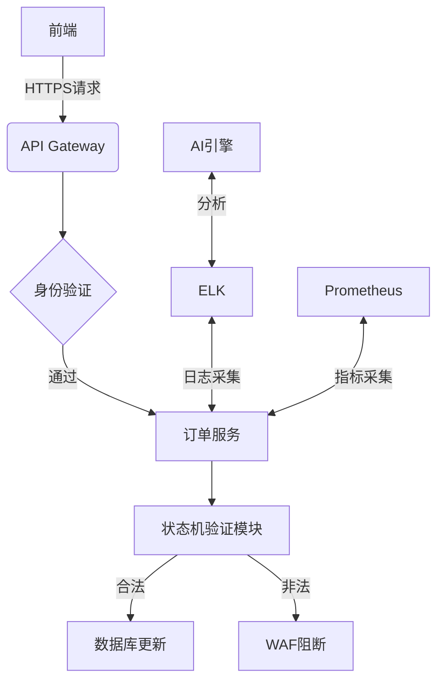

订单状态机完整性验证是Web应用安全的核心环节，尤其在电商、金融等涉及交易系统的场景中。以下从攻击面分析、检测方法、监控工具三个维度展开说明：

---

### 一、攻击面分析：订单状态机的典型漏洞
1. **非法状态跳转**  
   - 攻击者通过篡改HTTP参数（如`order_status=completed`）或API请求体，绕过支付验证直接完成订单
   - 案例：未支付订单通过修改`/api/order/status`接口的state参数实现发货

2. **逆向流程漏洞**  
   - 已取消/退货的订单被重新激活（如`CANCELED→PAID`的逆向操作）
   - 并发请求导致状态覆盖（如同时发起支付和退款请求）

3. **子状态逃逸**  
   - 在复合状态（如"发货中"包含"分拣/出库/运输"子状态）中越权操作未授权环节

---

### 二、检测方法：主动式防御策略

#### 1. 静态代码分析（SAST）
- **工具应用**  
  使用Checkmarx、Fortify扫描代码中状态转换逻辑，定位未授权跳转点：
  ```java
  // 漏洞代码示例：未校验前置状态
  public void updateStatus(Order order, String newStatus) {
      order.setStatus(newStatus); // 直接修改状态
  }
  ```
- **检测规则**  
  建立状态转换矩阵（如SCXML格式），验证代码是否符合预设状态机规则

#### 2. 动态流量测试（DAST）
- **Burp Suite高级测试**  
  使用Intruder模块批量篡改状态参数，检测异常响应（如200 OK返回非预期状态）
  ```http
  POST /update_order HTTP/1.1
  ...
  {"order_id":123, "new_status":"shipped"} # 原始值为"paid"
  ```

- **自动化API测试**  
  通过Postman编写状态流测试用例，验证合法/非法路径：
  ```javascript
  pm.test("支付前禁止发货", function () {
      pm.sendRequest({
          url: 'api/order/ship',
          method: 'POST',
          body: {orderId: 'UNPAID_ORDER'}
      }, (err, res) => {
          pm.expect(res.code).to.eql(403); // 预期拦截
      });
  });
  ```

#### 3. 业务逻辑验证
- **状态机建模工具**  
  使用开源框架（如XState）构建可视化状态机，生成测试用例：
  ```typescript
  const orderMachine = createMachine({
    id: 'order',
    initial: 'created',
    states: {
      created: { on: { PAY: 'paid' } },
      paid: { on: { SHIP: 'shipped' } },
      // 显式禁止created→shipped跳转
    }
  });
  ```

---

### 三、监控体系：实时防御与溯源

#### 1. 日志审计层
- **结构化日志规范**  
  记录关键字段便于后续分析：
  ```json
  {
    "timestamp": "2023-10-05T14:23:01Z",
    "user_id": "u123",
    "order_id": "o456",
    "old_status": "created",
    "new_status": "paid",
    "source_ip": "192.168.1.1",
    "auth_method": "JWT"
  }
  ```

- **ELK实时分析**  
  使用KQL查询异常模式：
  ```kql
  order_logs | where old_status == "created" and new_status == "shipped"
  ```

#### 2. 运行时防护
- **RASP拦截**  
  在应用层嵌入OpenRASP，实时阻断非法状态变更：
  ```python
  # OpenRASP规则示例
  def pre_update_order_status(params):
      current_status = get_current_status(params['order_id'])
      if not is_valid_transition(current_status, params['new_status']):
          raise BlockRequest('非法状态变更')
  ```

- **分布式追踪**  
  通过Jaeger追踪跨服务状态变更时序，识别异常调用链：
  ```
  OrderService.updateStatus → PaymentService.verify → ShippingService.activate
  ```

#### 3. 智能监控
- **基线告警**  
  使用Prometheus统计状态转换成功率，设置阈值告警：
  ```promql
  sum(rate(order_status_changes_total{result="failed"}[5m])) 
  / 
  sum(rate(order_status_changes_total[5m])) > 0.1
  ```

- **异常检测模型**  
  基于历史数据训练LSTM模型，识别非常规操作模式（如凌晨3点的批量状态重置）

---

### 四、工具链整合示例


---

### 五、最佳实践
1. **最小化原则**  
   每个状态变更接口仅允许指定操作（如发货接口只能处理`paid→shipped`）

2. **强制校验机制**  
   所有状态变更必须通过统一验证模块：
   ```java
   public void changeStatus(Order order, Status newStatus) {
       if (!StateMachine.allowTransition(order.currentStatus, newStatus)) {
           throw new IllegalStateException();
       }
       // 执行变更
   }
   ```

3. **版本化状态机**  
   使用Git管理状态机定义文件，确保测试与生产环境一致

通过以上方法，可构建覆盖开发、测试、生产全周期的订单状态机防护体系，有效防御业务逻辑漏洞。实际实施需结合OWASP ASVS 4.0及PCI DSS相关标准进行合规性验证。

---

*文档生成时间: 2025-03-13 09:11:24*


