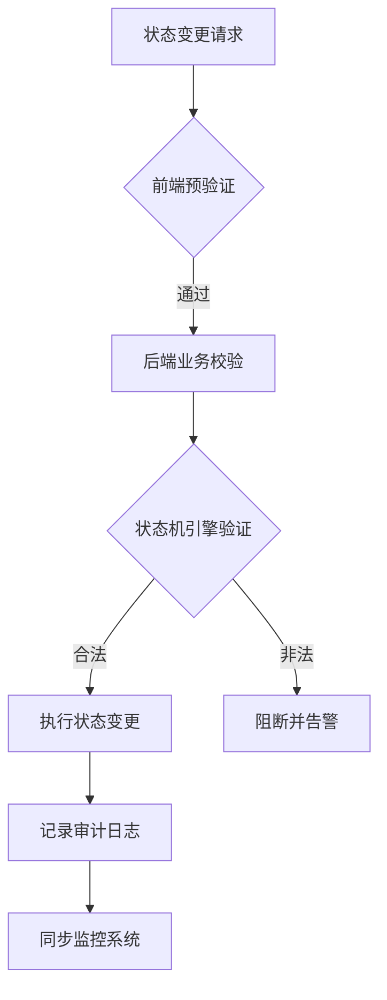

### 订单状态机完整性验证防御指南

#### 一、核心防御原则
1. **最小状态权限原则**  
   - 每个系统角色仅允许触发与其业务逻辑匹配的状态变更操作  
   - 示例：客服角色不应具备"支付成功→生产完成"的直接跳转权限

2. **全生命周期验证机制**  
   - 建立覆盖创建、变更、终结全流程的验证矩阵  
   - 强制要求所有状态变更必须通过验证引擎

3. **不可逆操作审计**  
   - 对退款完成、订单关闭等终结状态实施二次确认  
   - 关键状态变更需强制留存审批流水记录

#### 二、状态机验证层设计
1. **状态转换规则库**  
```python
# 基于有向图的状态转换模型
state_transitions = {
    "待支付": ["已取消", "支付中"],
    "支付中": ["支付成功", "支付失败"],
    "支付成功": ["备货中", "退款审核"],
    "备货中": ["已发货"]
}
```

2. **动态上下文验证器**  
   - 时间维度：验证相邻状态的时间间隔合理性（如支付成功到发货不得<5分钟）  
   - 业务维度：检查关联对象完整性（库存预占记录、物流单号）  
   - 环境维度：检测异常操作环境（非常用IP、新设备登录）

3. **双向验证机制**  
   - 前端提交时进行预验证（减少无效请求）  
   - 后端处理时实施原子级验证（最终决策层）

#### 三、攻击面防御策略
1. **非法路径阻断**  
   - 实时拦截非常规路径请求（如待支付→已发货）  
   - 对连续异常跳转实施自动锁定（5次异常操作触发账户冻结）

2. **参数完整性保护**  
```java
// 状态变更请求签名验证示例
public boolean verifyRequest(StateChangeRequest request) {
    String signature = HmacSHA256(request.getParams() + serverSalt);
    return signature.equals(request.getSignature());
}
```

3. **业务补偿机制**  
   - 设计自动回滚流程应对异常状态  
   - 建立人工干预通道处理边界情况

#### 四、监控与追溯体系
1. **实时监控矩阵**  
   - 异常路径告警：非标准状态转换即时通知  
   - 频率监控：单位时间内的状态变更次数阈值控制

2. **全链路追踪**  
   - 使用唯一追踪ID贯穿所有状态变更节点  
   - 记录完整操作上下文（操作者、时间戳、请求参数）

3. **审计日志规范**  
   | 字段名        | 记录要求                     |
   |---------------|----------------------------|
   | BeforeState   | 变更前状态（不可为空）        |
   | AfterState    | 变更后状态（不可为空）        |
   | Operator      | 操作主体（系统/用户ID）       |
   | VerifyResult  | 验证引擎输出详情              |

#### 五、测试验证方法论
1. **状态覆盖测试**  
   - 设计正向测试用例覆盖所有合法路径  
   - 构造异常测试用例验证防御有效性

2. **混沌工程实施**  
   - 模拟分布式锁失效时的并发状态变更  
   - 测试补偿机制在服务降级场景的可靠性

3. **历史漏洞复测**  
   - 建立已知攻击模式回归测试用例库  
   - 每季度执行全量路径验证

#### 六、第三方集成规范
1. **回调接口防护**  
   - 支付系统回调必须携带防重放参数  
   - 物流状态同步需验证来源IP白名单

2. **异步消息验证**  
   - 消息队列消费端实施幂等性检查  
   - 补偿任务需验证消息时序有效性

#### 七、应急响应流程
1. **异常状态处置**  
   - 自动冻结处于非法状态的订单  
   - 建立人工审核队列处理异常case

2. **数据修复规程**  
   - 仅允许通过专用工具执行状态修复  
   - 修复操作必须生成修复工单记录

#### 附录：典型防御模式


本指南提供从架构设计到运维监控的完整防御体系，需结合具体业务场景调整实施细节。建议每半年进行防御机制有效性评审，持续跟踪新型绕过手法的行业动态。

---

*文档生成时间: 2025-03-13 09:09:13*
