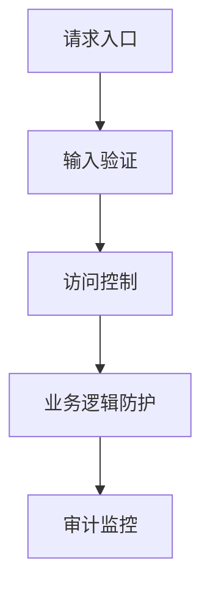
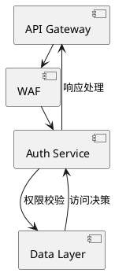

```markdown
# 业务参数遍历自动化防护技术白皮书

## 1. 业务参数遍历定义与危害
### 1.1 基本概念
业务参数遍历（Business Parameter Enumeration）是指攻击者通过系统化修改应用程序业务参数，枚举获取未授权访问敏感数据的攻击行为。其核心特征表现为对业务逻辑参数的自动化探测，典型攻击目标包括：

- 用户身份标识（UserID）
- 订单号/交易号
- 资源定位标识（文档ID、文件哈希）
- 分页参数（page、limit）
- 时间戳参数（start_time、end_time）

### 1.2 攻击危害
根据OWASP API Security Top 10统计，业务参数遍历位列TOP 3风险项，可能造成：
1. 敏感数据泄露（PII、PHI）
2. 业务逻辑越权（水平/垂直越权）
3. 系统资源耗尽（DoS攻击）
4. 商业数据资产窃取

## 2. 攻击原理与技术分类
### 2.1 自动化攻击原理

攻击流程通常包含以下阶段：
1. 参数指纹采集（Burp Suite/Postman流量捕获）
2. 参数模式分析（正则表达式识别）
3. 有效载荷生成（基于规则的字典构造）
4. 分布式探测执行（多线程/云函数）
5. 响应差异分析（状态码/内容长度对比）

### 2.2 技术分类体系
#### 2.2.1 按参数类型
| 类型        | 示例参数       | 攻击载荷示例         |
|-------------|----------------|----------------------|
| 线性参数    | user_id=1001   | 1002,1003,...,100+N  |
| 哈希参数    | doc_id=md5(...)| 彩虹表碰撞           |
| 时间参数    | start_time=... | 时间窗口遍历         |
| 复合参数    | order_no=...   | 多字段组合爆破        |

#### 2.2.2 按攻击方式
```python
# 典型Python攻击脚本示例
import requests
from concurrent.futures import ThreadPoolExecutor

def brute_force(param):
    url = f"https://api.example.com/data?user_id={param}"
    resp = requests.get(url)
    if resp.status_code == 200 and len(resp.content) > 100:
        print(f"Valid ID found: {param}")

with ThreadPoolExecutor(max_workers=50) as executor:
    executor.map(brute_force, range(1000, 9999))
```

## 3. 核心防护技术解析
### 3.1 分层防御体系


### 3.2 关键技术实现
#### 3.2.1 参数范围锁定
```java
// Spring Boot参数验证示例
@GetMapping("/user/{userId}")
public ResponseEntity<User> getUser(
    @PathVariable @Range(min=1000, max=9999) Integer userId) {
    // 业务逻辑
}
```

#### 3.2.2 上下文绑定验证
```python
# Django视图层防护示例
def get_order(request):
    user = request.user
    order_id = request.GET.get('order_id')
    order = Order.objects.get(id=order_id)
    if order.user != user:
        raise PermissionDenied
    # 返回订单数据
```

### 3.3 高级防护策略
1. **动态令牌机制**
   ```javascript
   // JWT令牌签名验证
   const token = jwt.sign({
     user_id: 123,
     valid_ids: [456, 789],
     exp: Math.floor(Date.now() / 1000) + 300
   }, SECRET_KEY);
   ```

2. **请求指纹分析**
   ```nginx
   # Nginx限流配置
   limit_req_zone $binary_remote_addr zone=api:10m rate=30r/m;
   ```

3. **行为模式检测**
   ```sql
   -- 异常访问SQL检测
   SELECT COUNT(DISTINCT param_value) 
   FROM access_log 
   WHERE api_path = '/api/user' 
     AND timestamp > NOW() - INTERVAL 1 MINUTE
   HAVING COUNT(*) > 100;
   ```

## 4. 企业级防护方案
### 4.1 防御架构设计


### 4.2 关键指标监控
| 监控维度      | 检测指标                     | 告警阈值       |
|---------------|------------------------------|----------------|
| 参数多样性    | 单参数不同值数量/分钟        | > 50           |
| 响应差异度    | 相同API响应长度标准差        | > 500 bytes    |
| 资源访问率    | 不存在资源访问占比           | > 20%          |

## 5. 防御建议与最佳实践
1. **输入验证强化**
   - 实施参数类型/格式/范围的三层校验
   - 对不可枚举参数强制使用HMAC签名

2. **访问控制升级**
   ```go
   // Go语言资源访问控制示例
   func GetResource(w http.ResponseWriter, r *http.Request) {
       requestedID := r.URL.Query().Get("res_id")
       if !isAuthorized(requestedID, r.Header.Get("X-User-Token")) {
           w.WriteHeader(http.StatusForbidden)
           return
       }
       // 返回资源
   }
   ```

3. **监控响应策略**
   - 对不存在资源返回统一错误格式
   - 实施动态响应延迟（针对自动化工具检测）

4. **架构级防护**
   - 实施API请求签名（如AWS SigV4）
   - 敏感数据接口强制要求OAuth 2.0范围验证

## 6. 结语
业务参数遍历的防御需要建立覆盖全生命周期的防护体系，建议企业从以下维度进行能力建设：

1. 建立参数安全规范（类型、范围、关联关系）
2. 实施自动化漏洞检测（DAST+IAST）
3. 部署运行时保护系统（RASP）
4. 构建威胁情报驱动的动态防御机制

防御效果的持续验证应通过定期红蓝对抗演练来保证，推荐每季度执行专项业务安全测试，重点关注参数遍历类漏洞的防护有效性。
```

---

*文档生成时间: 2025-03-12 21:26:20*
