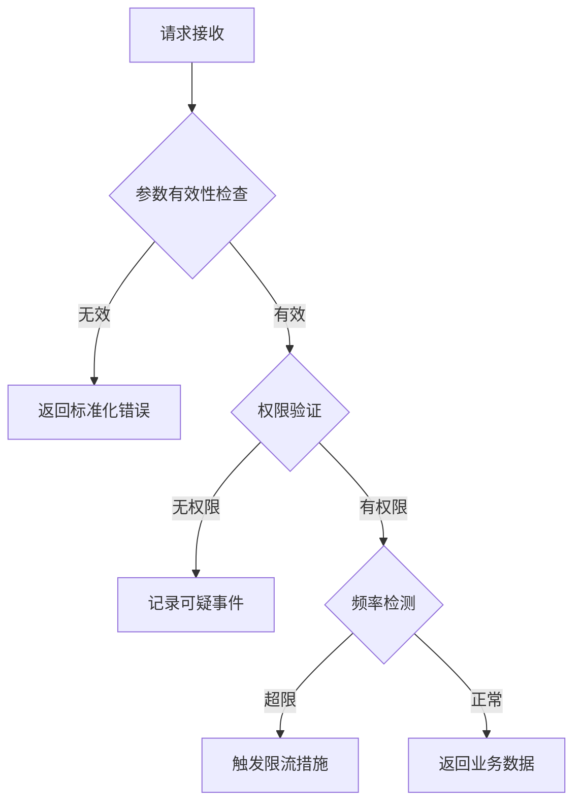

# 业务参数遍历自动化防护防御指南

## 1. 攻击原理概述
业务参数遍历攻击（Business Parameter Enumeration）指攻击者通过自动化工具（如Burp Intruder、自定义脚本）批量修改请求参数（如订单ID、用户账号、资源编号），探测超出权限范围的数据。典型特征包括：
- 使用连续/可预测的数值型参数（如order_id=10001~10050）
- 高频重复相似请求模式
- 使用字典枚举特定参数格式（如日期型YYYYMMDD）

## 2. 核心防御框架
### 2.1 参数混淆技术
#### 2.1.1 非连续化标识符
```python
# 使用UUID替代自增ID
import uuid
order_id = uuid.uuid4().hex  # 生成32位随机字符串
```

#### 2.1.2 参数加密方案
- 对称加密（AES-256）应用场景：
  ```javascript
  // 前端加密示例（需配合HTTPS）
  const encrypted = CryptoJS.AES.encrypt("10001", secretKey).toString();
  ```
- 服务端解密验证后需进行有效性校验（如数据库存在性检查）

#### 2.1.3 哈希校验机制
生成带盐值的参数哈希：
```
原始参数：10001 + 盐值 = 哈希(10001|pepper2023) → a3d8f1
请求路径：/order?a3d8f1
```

### 2.2 权限控制强化
#### 2.2.1 动态会话绑定
```java
// Spring Security实现示例
@PreAuthorize("#order.userId == authentication.principal.id")
public Order getOrder(String orderId, Long userId) { ... }
```

#### 2.2.2 多维度访问控制
| 控制维度       | 实施要点                          |
|----------------|---------------------------------|
| 时间有效性      | JWT令牌设置短期exp时间（≤15分钟）|
| 设备指纹绑定   | 结合浏览器指纹+IP地理位置        |
| 操作上下文验证 | 验证请求来源页面（Referer校验） |

### 2.3 频率限制策略
#### 2.3.1 分级限流模型
```nginx
# Nginx限流配置示例
limit_req_zone $binary_remote_addr zone=apiburst:10m rate=30r/m;

location /api/ {
    limit_req zone=apiburst burst=5 nodelay;
    error_page 503 =429 /ratelimited;
}
```

#### 2.3.2 智能行为分析
- 异常模式检测指标：
  - 相似URL参数变化频率 > 10次/秒
  - 非常用User-Agent（如HeadlessChrome）
  - 非常规时间段的集中访问（如凌晨2-4点）

### 2.4 响应混淆机制
#### 2.4.1 标准化错误消息
错误场景处理规范：
```json
// 有效请求
HTTP/1.1 200 OK
{"data": {"order_id": "a3d8f1", "status": "paid"}}

// 无效请求统一响应
HTTP/1.1 404 Not Found
{"code": "RESOURCE_NOT_FOUND", "message": "请求内容不存在"}
```

#### 2.4.2 延迟干扰策略
```python
# 疑似攻击请求处理
import random
if is_suspicious(request):
    time.sleep(random.uniform(1.5, 3.0))  # 增加攻击时间成本
```

## 3. 监测与响应
### 3.1 实时监控指标
| 监控项          | 阈值建议       | 响应动作               |
|-----------------|---------------|-----------------------|
| 同一参数访问频率 | >5次/10秒     | 触发二次认证           |
| 无效参数率       | >70%          | 临时封禁IP 30分钟      |
| 非常用参数模式   | 正则不匹配    | 记录审计日志并告警     |

### 3.2 自动化防御流程


## 4. 持续改进措施
1. **参数指纹库维护**：每月更新参数加密算法和盐值
2. **攻击模式分析**：季度性复盘拦截日志，优化正则规则
3. **混沌测试**：每季度使用自动化工具模拟攻击流量
4. **密钥生命周期管理**：采用HSM硬件模块实现密钥轮换

## 5. 实施路线图
1. 第一阶段（1-2周）：部署基础参数加密和错误标准化
2. 第二阶段（3-4周）：实施分级限流和会话绑定
3. 第三阶段（5-6周）：建立行为分析模型和自动化拦截
4. 第四阶段（持续）：开展红蓝对抗演练和策略优化

本方案通过建立参数混淆、权限验证、频率控制的三层防御体系，结合实时监控与自动化响应机制，可有效对抗自动化参数遍历攻击。建议每半年进行第三方渗透测试验证防护效果，确保防御策略持续有效。

---

*文档生成时间: 2025-03-12 21:37:39*
