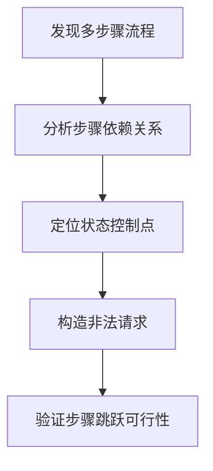

```markdown
# 业务流程跳跃攻击分析与防御指南

## 1. 定义与核心概念
业务流程跳跃攻击（Business Process Jump Attack）是一种针对多步骤业务逻辑的高级攻击方式。攻击者通过非法跳过或绕过既定业务流程中的关键步骤，直接访问或操作后续敏感环节，破坏业务逻辑完整性以实现未授权操作。

与传统的越权攻击相比，该攻击具有以下特征：
- 利用业务逻辑的流程控制缺陷
- 需要深入理解目标业务流程拓扑
- 通常伴随状态篡改和参数操控
- 可造成认证/授权机制旁路

## 2. 攻击原理与技术框架

### 2.1 核心攻击路径


### 2.2 关键技术要素
1. **步骤标识符篡改**：操控step、stage等流程控制参数
2. **状态令牌伪造**：绕过服务端状态验证机制
3. **API端点预测**：通过枚举或逆向发现隐藏接口
4. **数据完整性破坏**：非预期步骤的数据提交

## 3. 攻击分类与典型场景

### 3.1 顺序跳跃攻击
通过修改流程步骤顺序参数，直接访问后续步骤：
```http
POST /checkout?step=payment HTTP/1.1
（未完成地址验证步骤）
```

### 3.2 参数篡改攻击
示例：修改流程控制参数
```python
# 原始请求参数
{"current_step": 2, "next_step": 3}

# 攻击篡改后
{"current_step": 2, "next_step": 5}
```

### 3.3 状态篡改攻击
篡改服务端会话中的流程状态标记：
```javascript
// 篡改浏览器端状态存储
localStorage.setItem('processState', 'completed');
```

### 3.4 直接访问攻击
预测或发现未公开的流程端点：
```
正常流程：/process/step1 → /process/step2 → /process/step3
攻击访问：直接请求 /process/step3
```

### 3.5 异步流程劫持
利用前后端分离架构的API调用缺陷：
```http
POST /api/v1/checkout/confirm HTTP/1.1
（未完成前置验证步骤）
```

## 4. 技术细节与攻击实例

### 4.1 步骤参数篡改
**攻击流程**：
1. 拦截多步骤请求
2. 修改step参数值
3. 验证服务端响应

**代码示例**：
```python
import requests

session = requests.Session()
# 正常步骤请求
session.post("/process", data={"step": "validation"})
# 跳跃攻击
response = session.post("/process", data={"step": "finalize"})
print(response.status_code)  # 检测200响应
```

### 4.2 状态标识符预测
**攻击向量**：
```
合法状态令牌：dG9rZW49MTIzNDU2Nzg5MA==
尝试预测：dG9rZW49MTIzNDU2Nzg5MQ==
```

### 4.3 服务端状态验证绕过
**漏洞代码示例**：
```java
// 错误的状态验证逻辑
if (request.getParameter("step").equals("confirm")) {
    // 未验证前置步骤是否完成
    processConfirmation();
}
```

### 4.4 时间维度跳跃攻击
利用业务流程中的时间控制缺陷：
```http
POST /schedule?phase=approve&timestamp=20240501
（篡改时间参数提前触发审批）
```

## 5. 漏洞检测方法论

### 5.1 静态检测
- 代码审计关注点：
  ```javascript
  // 危险模式：直接依赖客户端传入的流程状态
  function handleStep(step) {
    switch(step) {
      case 'payment': processPayment(); break;
      // 缺少前置步骤验证
    }
  }
  ```

### 5.2 动态检测
使用Burp Suite进行流程测试：
1. 使用Sequencer分析状态令牌熵值
2. 通过Intruder进行步骤参数枚举
3. 利用Repeater测试步骤跳跃

### 5.3 业务流拓扑分析
构建流程状态机模型：
```
正常流程：A → B → C → D
异常路径检测：A → C, B → D
```

## 6. 防御方案设计

### 6.1 服务端状态管理
```python
# Django示例：服务端维护流程状态
def process_view(request):
    current_state = request.session.get('process_state')
    if current_state != EXPECTED_STATE:
        return HttpResponseForbidden()
    # 处理逻辑
    request.session['process_state'] = NEXT_STATE
```

### 6.2 步骤顺序验证
```java
// 步骤验证中间件
public void validateStepOrder(HttpServletRequest request) {
    String currentStep = request.getParameter("step");
    String lastStep = (String) request.getSession().getAttribute("lastStep");
    
    if (!validTransitions.get(lastStep).contains(currentStep)) {
        throw new IllegalStateException("Invalid step transition");
    }
}
```

### 6.3 数据完整性保护
HMAC签名验证示例：
```python
import hmac

def generate_step_token(step, secret):
    signature = hmac.new(secret, step.encode(), 'sha256').hexdigest()
    return f"{step}:{signature}"

def validate_step_token(token, secret):
    step, received_sig = token.split(':', 1)
    expected_sig = hmac.new(secret, step.encode(), 'sha256').hexdigest()
    return hmac.compare_digest(received_sig, expected_sig)
```

### 6.4 防御矩阵设计
| 防御层级        | 技术措施                          | 实施要点                     |
|-----------------|-----------------------------------|------------------------------|
| 状态管理层      | 服务端会话存储                    | 加密存储、定期刷新           |
| 流程控制层      | 有限状态机验证                    | 严格定义状态转换规则         |
| 数据完整性层    | HMAC参数签名                      | 密钥安全管理                |
| 监控层          | 异常步骤日志分析                  | 设置步骤跳跃告警阈值         |

## 7. 企业级防护建议

1. **流程拓扑强化**：
   - 建立业务流程图谱
   - 定义合法状态转换规则
   - 实现自动化流程合规检查

2. **架构级防护**：
   ```mermaid
   graph LR
   A[客户端] --> B(API网关)
   B --> C{流程验证引擎}
   C --> D[业务微服务]
   C --> E[审计日志系统]
   ```

3. **纵深防御体系**：
   - 边界防御：WAF规则（如ModSecurity流程控制规则）
   - 运行时防护：RASP检测异常流程调用
   - 审计追踪：全流程操作日志记录

4. **攻防演练**：
   - 定期进行流程跳跃攻击红队演练
   - 构建业务流程威胁模型（STRIDE）
   - 自动化漏洞扫描（流程跳跃检测插件）

## 结语
业务流程跳跃攻击作为逻辑漏洞的高级形态，需要防御者从系统架构层面建立多层防护。建议采用服务端状态机验证、参数完整性保护、实时监控告警三位一体的防御策略，同时结合定期安全审计和自动化检测工具，构建完整的业务流程安全防护体系。
```

---

*文档生成时间: 2025-03-12 20:38:03*
