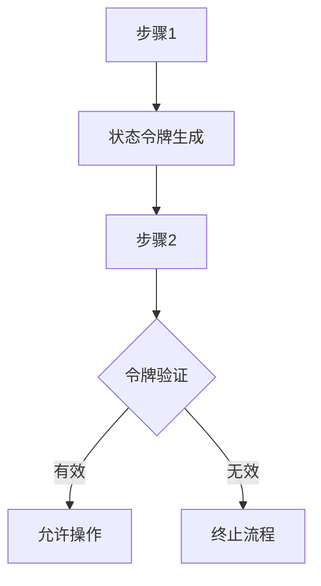
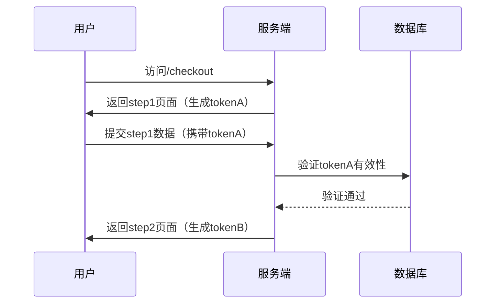

# 业务流程跳跃攻击防御指南

## 1. 攻击原理与风险概述
业务流程跳跃攻击（Business Process Bypass Attack）是指攻击者通过绕过预设的业务流程步骤，直接访问或操作本应受前置条件限制的功能模块。典型攻击场景包括：
- 跳过身份验证步骤直接访问敏感操作接口
- 绕过多步骤流程中的中间验证环节（如支付流程中的风控检查）
- 篡改流程状态参数提前完成业务生命周期（如未发货提前确认收货）

此类攻击可导致业务逻辑完整性破坏、未授权操作、数据篡改等高风险漏洞。

---

## 2. 核心防御原则

### 2.1 流程完整性验证


### 2.2 分层防御机制
1. 服务端状态管理：禁止依赖客户端传递的流程状态
2. 上下文关联验证：建立操作与前置条件的强关联性
3. 动态令牌技术：每个步骤生成不可预测的验证凭证

---

## 3. 具体防御措施

### 3.1 流程状态强制验证
- **服务端会话存储**：
  使用加密的服务器端会话记录当前流程进度，拒绝未完成前置步骤的请求
  ```python
  # Django示例：服务端会话管理
  def process_step(request):
      if not request.session.get('step1_completed'):
          return HttpResponseForbidden()
      if validate_step_token(request.POST.get('token')):
          # 处理步骤2逻辑
          request.session['step2_completed'] = True
  ```

- **动态流程令牌**：
  为每个步骤生成加密令牌，包含流程ID、步骤序号、时间戳和数字签名
  ```java
  // JWT令牌生成示例
  String token = Jwts.builder()
    .claim("processId", processId)
    .claim("currentStep", 2)
    .signWith(SignatureAlgorithm.HS512, secretKey)
    .compact();
  ```

### 3.2 上下文关联验证
- **操作指纹验证**：
  ```javascript
  // 浏览器环境指纹生成
  const fingerprint = CryptoJS.SHA256(
    navigator.userAgent + 
    window.screen.width + 
    getClientTimezone()
  ).toString();
  ```

- **业务参数绑定**：
  将关键业务参数（如订单号、用户ID）与流程令牌进行HMAC绑定

### 3.3 双重验证机制
| 验证类型       | 实现方式                      | 防护场景               |
|----------------|-----------------------------|-----------------------|
| 时间窗口验证   | 限制步骤间最大时间间隔（<5分钟） | 防止长期滞留流程绕过    |
| 操作序列验证   | 记录并验证操作顺序哈希链       | 防止步骤顺序篡改       |
| 设备绑定验证   | 将流程令牌与设备指纹绑定       | 防止跨设备流程跳跃     |

---

## 4. 技术实现规范

### 4.1 服务端状态机
```go
// 状态机实现示例
type OrderProcess struct {
    CurrentStep int `json:"current_step"`
    ValidSteps  []int `json:"valid_steps"` // [1,2,3,4]
}

func ValidateStep(process OrderProcess, requestedStep int) bool {
    // 验证请求步骤是否在当前有效步骤之后
    for _, step := range process.ValidSteps {
        if step == requestedStep {
            return process.CurrentStep >= step - 1
        }
    }
    return false
}
```

### 4.2 请求完整性验证
- **参数签名机制**：
  ```python
  def generate_signature(params, secret):
      sorted_params = urllib.parse.urlencode(sorted(params.items()))
      return hmac.new(secret.encode(), sorted_params.encode(), hashlib.sha256).hexdigest()
  ```

- **防重放攻击**：
  使用递增nonce值并服务端缓存验证
  ```redis
  SETEX nonce:{user_id}:{nonce} 300 1
  ```

---

## 5. 检测与响应策略

### 5.1 异常检测指标
- 同一会话中步骤间隔时间＜100ms
- 非连续步骤访问（如直接从step1访问step3）
- 高频的HTTP 403/401响应码

### 5.2 防御性编程模式
```javascript
// 前端防御示例：禁止直接跳转
router.beforeEach((to, from, next) => {
  if (!isValidTransition(from.meta.step, to.meta.step)) {
    store.dispatch('logAbnormalFlow', {from: from.path, to: to.path})
    next({ path: '/error/403' })
  } else {
    next()
  }
})
```

---

## 6. 典型案例防护

### 案例1：电商订单流程防护


### 案例2：贷款申请流程
- 实施四层验证：
  1. 生物识别验证（活体检测）
  2. 申请进度令牌（JWT）
  3. 文档哈希值链式存储
  4. 操作时间窗口（每步骤5-15分钟）

---

## 7. 安全测试方案

### 7.1 自动化测试脚本
```bash
# 使用Burp Suite宏测试流程完整性
python3 bypass_test.py --url https://api.example.com/process \
  --steps 5 \
  --validate-params order_id,user_token
```

### 7.2 渗透测试要点
1. 修改HTTP请求中的step参数（step=1 → step=3）
2. 删除请求中的流程令牌参数
3. 并发请求不同步骤接口
4. 重放已完成步骤的请求

---

## 8. 持续改进建议

1. 建立流程操作基线模型（平均完成时间、典型操作序列）
2. 每季度进行流程逻辑审计
3. 关键流程实施硬件安全模块（HSM）签名
4. 结合UEBA检测异常操作模式

通过实施以上多维度防御策略，可有效防范90%以上的业务流程跳跃攻击。建议结合OWASP ASVS 4.0的V12业务逻辑安全要求进行合规性验证，确保防御措施覆盖全业务流程生命周期。

---

*文档生成时间: 2025-03-12 20:51:18*
