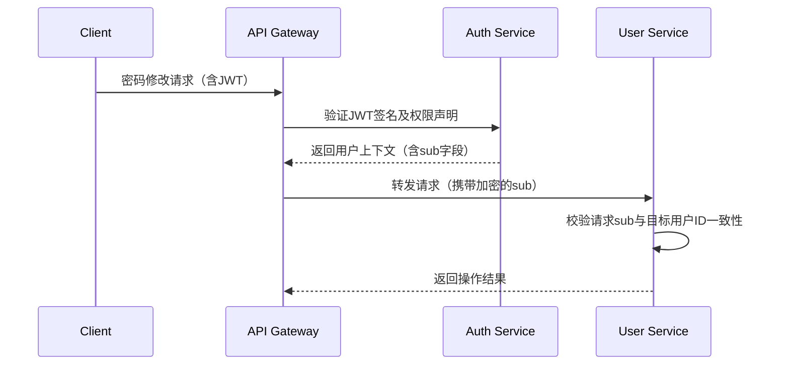

# 平行越权密码修改防御指南

## 1. 攻击原理概述
平行越权密码修改（Horizontal Privilege Escalation in Password Reset）指攻击者通过技术手段绕过系统权限控制，利用合法账号修改其他同级用户密码的漏洞。其核心成因包括：
- 用户身份与密码修改操作未严格绑定
- 会话/令牌未绑定用户唯一标识
- API接口未验证操作主体与目标对象的归属关系
- 业务逻辑缺陷导致参数篡改漏洞

## 2. 核心防御策略

### 2.1 身份二次验证机制
**实施要求：**
- 密码修改流程必须包含双因子验证（2FA）
- 生物特征验证（如人脸识别）需活体检测
- 短信/邮箱验证码需具备时效性（建议≤5分钟）和单次有效性

**技术方案：**
```python
def validate_password_change_request(user, token):
    if not verify_2fa(user, token):
        audit_log(f"Failed 2FA attempt for {user.id}")
        raise PermissionDenied
    if not check_request_ownership(user, current_session):
        audit_log(f"Session hijacking detected for {user.id}")
        terminate_session(user.id)
```

### 2.2 权限动态校验
**强制验证规则：**
1. 前端向后端传递修改请求时，必须包含加密的当前用户身份标识
2. 后端需验证请求者身份与目标账户的归属关系
3. 验证逻辑必须发生在业务处理前

**代码级防御示例：**
```java
public void changePassword(String newPassword, String targetUserId) {
    // 从安全上下文中获取当前认证用户
    User principal = SecurityContext.getAuthenticatedUser();
    
    // 验证操作主体与目标对象关系
    if (!principal.getId().equals(targetUserId)) {
        throw new HorizontalPrivilegeEscalationException();
    }
    
    // 执行密码修改逻辑
    passwordService.updatePassword(targetUserId, newPassword);
}
```

### 2.3 请求参数加固
**关键防御点：**
- 用户ID参数必须使用服务端生成的加密令牌（HMAC-SHA256）
- 禁止使用自增ID或可预测的UUIDv1
- 请求必须包含防重放攻击的随机数（Nonce）

**参数验证流程：**
```
客户端请求 ->
[1] 解密用户令牌，验证时效性和签名
[2] 比对解密后的用户ID与session绑定ID
[3] 验证Nonce值未被重复使用
```

### 2.4 会话绑定机制
**多维度绑定策略：**
| 绑定维度      | 实施方法                          | 检测阈值       |
|---------------|-----------------------------------|----------------|
| IP地址        | 记录初始登录IP                    | 变更即时阻断   |
| User-Agent     | 哈希值比对                        | 差异值>30%阻断 |
| 设备指纹      | 集成可信设备认证SDK               | 新设备需验证   |
| 地理位置      | 结合IP地理数据库（MaxMind）       | 跨地域需验证   |

### 2.5 审计日志强化
**日志记录规范：**
- 记录完整的请求指纹：包括X-Forwarded-For、设备指纹、用户行为序列
- 关联操作流水号：贯穿前端点击到后端处理的完整链路
- 异常模式检测：对同一IP/设备的频繁密码修改操作（>3次/小时）触发风控

**日志分析模型：**
```sql
CREATE TRIGGER password_change_audit 
AFTER UPDATE ON users 
FOR EACH ROW 
BEGIN
    INSERT INTO security_audit_log
    (event_type, user_id, old_value, new_value, device_hash, request_fingerprint)
    VALUES
    ('password_change', NEW.id, OLD.password_hash, NEW.password_hash, 
     CURRENT_DEVICE_FINGERPRINT, REQUEST_SIGNATURE);
END;
```

## 3. 架构级防御

### 3.1 微服务鉴权设计


### 3.2 敏感操作隔离
- 密码修改服务独立部署在安全区（Security Zone）
- 使用专用网络通道（如AWS PrivateLink）
- 配置独立的WAF规则：
  ```nginx
  location /api/password-reset {
      limit_req zone=auth_burst burst=5 nodelay;
      deny 192.168.0.0/16; # 禁止内网直接访问
      proxy_pass http://password-service;
  }
  ```

## 4. 测试验证方案

### 4.1 自动化测试用例
```yaml
test_cases:
  - name: 横向越权密码修改测试
    steps:
      - 以用户A登录，获取有效会话令牌
      - 修改请求中的用户ID参数为B
      - 发送密码修改请求
    expected:
      - 返回403 Forbidden
      - 生成安全告警事件
      - 用户B的密码未变更

  - name: 参数篡改测试
    steps:
      - 使用BurpSuite修改请求体中的加密令牌
      - 重放篡改后的请求
    expected:
      - 服务端检测到签名不匹配
      - 触发防重放机制
```

### 4.2 渗透测试要点
1. 测试修改密码接口是否接受任意用户ID参数
2. 验证加密令牌是否可被离线破解（使用JWT_Tool）
3. 检查密码修改后的会话是否保持有效（应强制重新登录）
4. 尝试通过XSS获取其他用户的CSRF Token

## 5. 应急响应流程

**检测到越权攻击时的响应步骤：**
1. 立即熔断密码修改服务（服务降级）
2. 回滚受影响用户的密码到前一个有效版本
3. 分析攻击指纹并更新WAF规则
4. 对近24小时内的密码修改操作进行全量审计
5. 根据GDPR等法规要求进行事件通告

## 6. 典型修复案例

**案例背景：**
某电商平台存在通过修改手机号实现越权改密的漏洞

**攻击流程：**
```
1. 攻击者登录自身账户A
2. 拦截修改手机号的请求，替换为受害者B的手机号
3. 通过短信验证码完成手机号绑定变更
4. 使用新绑定的手机号重置用户B的密码
```

**修复方案：**
1. 增加手机号变更的冷却期（≥24小时）
2. 实施手机号归属验证（运营商二次验证）
3. 建立账户操作关联图谱，异常修改触发人工审核

本指南持续更新，建议结合OWASP ASVS v4.0.3标准第2.5章节进行合规性验证。所有防御措施需通过AB测试验证可用性影响，确保安全性与用户体验的平衡。

---

*文档生成时间: 2025-03-12 17:27:33*
