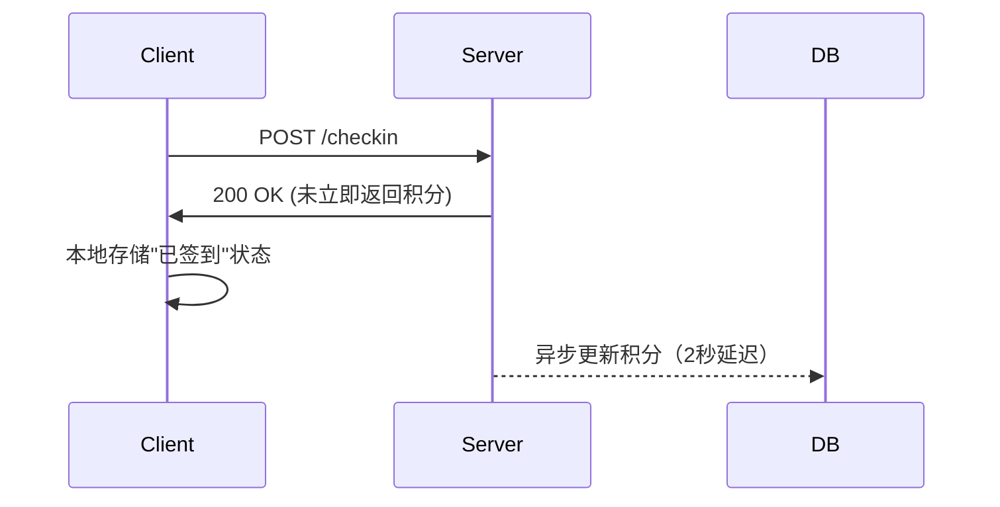

### 虚拟资产重复领取漏洞检测案例分析（Web安全方向）

#### 一、漏洞定义与危害
虚拟资产重复领取漏洞（Duplicate Claim Vulnerability）是指用户通过技术手段绕过系统限制，多次获取本应只能领取一次的虚拟资产（如积分、优惠券、游戏道具、数字货币等）。这类漏洞通常源于业务逻辑缺陷或接口设计不当，可导致企业经济损失、用户信任危机及系统资源耗尽。

#### 二、典型案例分析

##### **案例1：电商平台优惠券并发请求漏洞**
**背景**：某头部电商平台推出"新用户注册即领100元优惠券"活动，攻击者通过并发请求实现单账号多次领取。

**漏洞成因**：
1. **缺乏原子性操作**：后端接口未使用数据库事务或分布式锁
2. **状态校验延迟**：优惠券发放后需0.5秒更新用户领取状态
3. **无请求幂等性控制**：未采用唯一请求ID机制

**攻击过程**：
```python
import threading
import requests

def claim_coupon():
    headers = {"Authorization": "Bearer user_token"}
    for _ in range(10):
        requests.post("/api/coupon/claim", headers=headers)

# 启动10个并发线程
threads = []
for i in range(10):
    t = threading.Thread(target=claim_coupon)
    threads.append(t)
    t.start()
```
攻击者在200ms内发送100次请求，系统在并发条件下错误发放了10张优惠券。

**检测方法**：
- **并发测试**：使用Burp Suite Turbo Intruder发送并行请求
- **时间窗口分析**：检测两次请求间隔小于状态更新时间的场景
- **数据库事务监控**：通过MySQL general log观察事务隔离级别

##### **案例2：区块链游戏NFT空投漏洞**
**背景**：某GameFi项目通过签名验证发放NFT，攻击者利用签名重放获取多个稀有道具。

**技术细节**：
```solidity
// 漏洞合约代码片段
function claimAirdrop(bytes memory signature) external {
    require(!isClaimed[msg.sender], "Already claimed");
    bytes32 message = prefixed(keccak256(msg.sender));
    require(recoverSigner(message, signature) == signer, "Invalid signature");
    isClaimed[msg.sender] = true;
    _mint(msg.sender, NFT_ID);
}
```
漏洞点：未将nonce值纳入签名内容，导致同一签名可重复使用。

**攻击实例**：
1. 用户首次调用`claimAirdrop()`领取成功
2. 通过代理合约绕过前端限制重复调用：
```solidity
contract Exploit {
    function attack(address target, bytes memory sig) external {
        for(uint i=0; i<5; i++){
            IAirdrop(target).claimAirdrop(sig);
        }
    }
}
```
导致单地址铸造5个相同NFT。

**检测技术**：
- **签名分析**：检查签名是否包含时间戳/nonce
- **链上交易追踪**：通过Etherscan验证同一签名使用次数
- **状态变量校验**：使用MythX检测合约重入风险

##### **案例3：社交平台积分双端校验绕过**
**背景**：某社交APP的每日签到积分系统存在客户端校验漏洞。

**漏洞模式**：

攻击者在服务器响应后立即关闭网络，利用客户端状态未同步实施重放攻击。

**检测流程**：
1. 使用Fiddler拦截POST请求
2. 修改响应状态码从200→500触发客户端重试
3. 观察积分账户变化：
```
首次请求：+10积分
重放请求：+10积分（漏洞存在）
```

#### 三、检测方法论

##### **1. 业务流建模**
- 绘制资产发放状态机
- 标记关键校验节点：
  ```
  用户身份→资格验证→状态锁定→资产发放→日志记录
  ```

##### **2. 自动化检测工具**
- **OWASP ZAP**：自定义脚本检测重放请求
- **Postman**：构建请求链测试接口幂等性
- **Truffle Suite**：对智能合约进行模糊测试

##### **3. 专项测试方案**
| 测试类型       | 检测手段                          | 预期结果           |
|----------------|-----------------------------------|--------------------|
| 并发测试       | 50线程同时发送领取请求           | 资产计数=1         |
| 断点续传测试   | 中断请求后重连                   | 事务回滚           |
| 时间穿越测试   | 修改客户端时间戳重复触发         | 服务端时间校验拦截 |

##### **4. 分布式系统检测**
在微服务架构下需验证：
```bash
# 检查Redis分布式锁实现
redis-cli --eval check_lock.lua key1 key2 , arg1
# 输出结果应为：
"LOCK_EXISTS"
```

#### 四、防御策略

##### **1. 幂等性设计**
- 请求唯一ID机制：
  ```java
  String requestId = UUID.randomUUID().toString() + "_" + System.currentTimeMillis();
  redis.setnx(requestId, "processing", 300); // 设置5分钟过期
  ```

##### **2. 状态锁定策略**
数据库设计示例：
```sql
CREATE TABLE asset_claims (
    id BIGINT PRIMARY KEY,
    user_id INT NOT NULL,
    asset_type VARCHAR(20) NOT NULL,
    UNIQUE KEY idx_unique_claim (user_id, asset_type)
) ENGINE=InnoDB;
```

##### **3. 异步处理防护**
Kafka消费端防重处理：
```scala
kafkaConsumer.subscribe(Collections.singleton("asset_claims"))
consumer.poll(Duration.ofMillis(100)).forEach { record =>
  val key = s"${record.userId}_${record.assetId}"
  if (redis.setnx(key, "processing", 300)) {
    processClaim(record)
    redis.del(key)
  }
}
```

##### **4. 智能合约防护**
改进后的NFT领取函数：
```solidity
mapping(address => uint256) public nonce;

function claimAirdrop(bytes memory signature, uint256 _nonce) external {
    require(_nonce == nonce[msg.sender], "Invalid nonce");
    bytes32 message = keccak256(abi.encodePacked(msg.sender, _nonce));
    require(recoverSigner(message, signature) == signer, "Invalid signature");
    nonce[msg.sender]++;
    _mint(msg.sender, NFT_ID);
}
```

#### 五、行业影响与趋势
1. **金融科技领域**：2023年某数字银行因积分漏洞损失$220万
2. **游戏行业**：头部手游公司年均防护成本增加40%
3. **检测技术演进**：
   - 基于AI的异常模式识别（如AWS Fraud Detector）
   - 区块链预言机实时验证
   - 零知识证明验证领取资格

#### 结语
虚拟资产重复领取漏洞的检测需要融合业务逻辑分析、代码审计和实时监控技术。随着Web3.0和元宇宙经济发展，该领域的安全防护将从传统的事务控制向智能合约验证、链上链下协同校验等方向深度演进。建议企业建立覆盖SDLC全流程的检测机制，结合灰盒测试与实时风控系统构建多层防御体系。

---

*文档生成时间: 2025-03-12 21:21:45*


