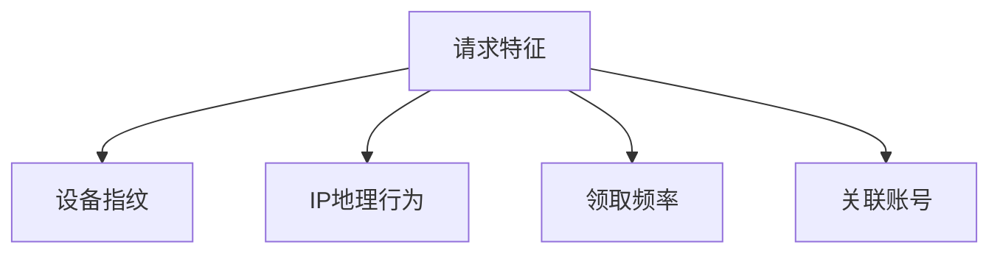
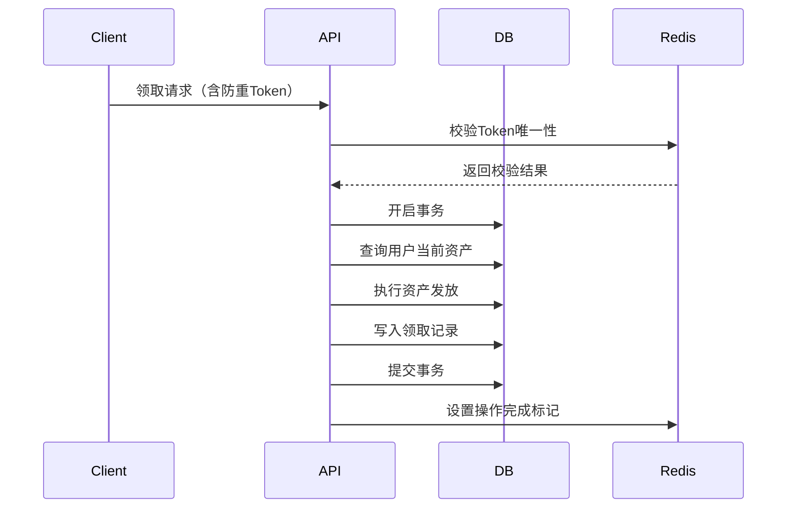

### 虚拟资产重复领取漏洞检测与防御策略（Web安全方向）

#### 一、漏洞原理与攻击场景
虚拟资产重复领取漏洞是指攻击者通过技术手段绕过系统限制，多次获取本应仅限单次领取的虚拟资产（如优惠券、积分、数字货币、游戏道具等）。典型攻击场景包括：
1. **接口重放攻击**：通过重复调用资产领取接口实现多次领取
2. **并发请求竞争**：利用高并发请求绕过服务端校验逻辑
3. **客户端篡改**：修改前端参数或绕过客户端校验逻辑
4. **状态覆盖漏洞**：利用业务流程中的状态更新缺陷覆盖领取记录

#### 二、核心防御策略
##### 1. 请求幂等性设计
**原理**：确保同一业务请求仅产生一次实际效果
- **实施方法**：
  - 采用唯一请求ID（UUID或业务流水号）机制
  - 服务端建立请求ID存储库（如Redis），执行前校验ID唯一性
  - 示例代码：
    ```python
    def claim_asset(request):
        request_id = request.headers.get('X-Request-ID')
        if redis.exists(request_id):
            return {"code": 409, "msg": "Duplicate request"}
        # 处理业务逻辑
        redis.set(request_id, ex=3600)
    ```

##### 2. 并发控制机制
**场景**：防止高并发场景下的库存/状态竞争问题
- **技术方案**：
  - 数据库锁机制：
    - 悲观锁（SELECT FOR UPDATE）
    - 乐观锁（版本号校验，CAS操作）
  - 分布式锁（Redis Redlock/ZooKeeper）
  - 示例（MySQL乐观锁）：
    ```sql
    UPDATE assets SET balance = balance - 1, version = version + 1 
    WHERE user_id = 123 AND version = current_version
    ```

##### 3. 业务状态验证链
**原则**：建立多层级校验体系，避免单点依赖
- **关键校验点**：
  - 用户身份绑定校验（JWT/OAuth2 token）
  - 领取资格实时验证（是否满足活动规则）
  - 资产库存原子操作：
    ```redis
    DECRBY asset_pool:coupon_100 1
    ```

##### 4. 风控规则引擎
**检测维度**：


- **实施要点**：
  - 建立用户行为基线（正常领取间隔、设备类型等）
  - 动态规则配置（如单个IP每小时最大领取次数）
  - 实时阻断异常请求（集成WAF或自定义中间件）

##### 5. 日志审计与溯源
**数据采集要求**：
| 字段类型       | 采集内容示例                  |
|----------------|-----------------------------|
| 基础信息       | 用户ID、时间戳、请求IP       |
| 业务参数       | 资产类型、领取渠道、活动ID   |
| 环境特征       | 设备指纹、浏览器指纹         |
| 处理结果       | 领取状态、失败原因代码        |

**分析策略**：
- 基于ELK/Splunk构建日志分析平台
- 设置异常模式告警规则（如相同用户5秒内多次领取）

#### 三、最佳实践方案
##### 1. 接口设计规范
- **强制校验参数**：
  ```javascript
  // 领取请求必须包含防重签名
  const sign = HMAC_SHA256(userId + assetId + timestamp, secretKey)
  ```
- **速率限制**：
  ```nginx
  limit_req_zone $binary_remote_addr zone=asset_api:10m rate=5r/s;
  ```

##### 2. 事务型处理流程


##### 3. 自动化测试方案
**测试用例设计**：
```gherkin
Scenario: 重复领取防御测试
    Given 用户已成功领取"VIP礼包"
    When 使用相同请求参数再次提交
    Then 返回错误码"DUPLICATE_CLAIM"
    And 数据库资产数量未增加
```

**测试工具**：
- Postman Newman批量测试
- JMeter模拟并发请求
- Burp Suite重放攻击测试

##### 4. 监控响应机制
- **实时仪表盘指标**：
  - 领取成功率异常波动
  - 相同设备指纹的跨账户操作
  - 非工作时间段的突发请求量

- **处置流程**：
  1. 自动触发人工审核流程
  2. 临时冻结可疑账户
  3. 资产追回机制设计（需预留业务回滚接口）

#### 四、进阶防护措施
1. **区块链存证**：
   - 将关键操作记录上链（如Hyperledger Fabric）
   - 实现操作记录的不可篡改性

2. **机器学习模型**：
   - 使用LSTM网络分析用户行为序列
   - 特征工程包含：
     - 请求时间分布熵值
     - 设备环境异常评分
     - 历史行为相似度

3. **零信任架构**：
   - 基于SPIFFE的身份认证
   - 持续验证设备安全状态
   - 微服务间mTLS通信加密

#### 五、典型错误案例
1. **仅依赖客户端校验**：
   ```java
   // 错误示例：仅前端校验领取次数
   function checkClaim() {
       if(localStorage.getItem('claimed')) {
           alert('已领取');
           return false;
       }
   }
   ```

2. **非原子性操作**：
   ```python
   # 错误示例：先查询后更新存在时间差
   if user.asset_count < 1:
       user.asset_count += 1
       user.save()
   ```

3. **缺乏全局锁**：
   ```php
   // 错误示例：未处理分布式环境并发
   $count = $redis->get('asset_count');
   if($count > 0) {
       $redis->decr('asset_count');
   }
   ```

#### 六、总结
有效的防御体系需要构建包含以下要素的多层防护：
1. **技术层面**：幂等设计+原子操作+风控规则
2. **架构层面**：分布式锁+事务一致性+服务降级
3. **运营层面**：实时监控+快速响应+定期攻防演练
4. **合规层面**：满足GDPR等数据法规要求，保留完整操作日志

建议每季度进行以下安全活动：
- 业务逻辑漏洞专项审计
- 领取接口模糊测试
- 红蓝对抗演练
- 第三方组件安全评估

通过纵深防御体系建设和持续安全运营，可有效将虚拟资产重复领取风险控制在可接受范围内。

---

*文档生成时间: 2025-03-12 21:12:51*


