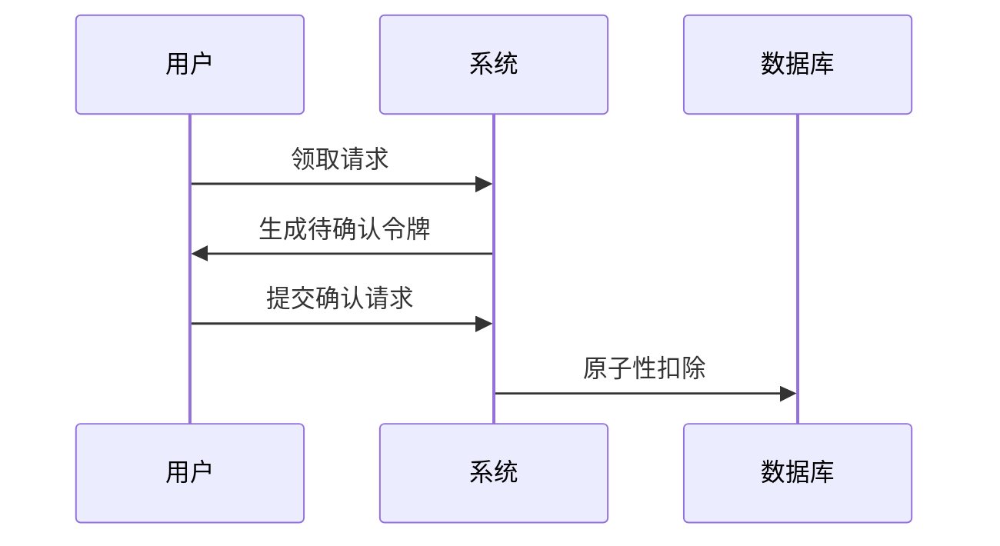

# 虚拟资产并发领取防御指南

## 一、核心问题定义
虚拟资产并发领取攻击指在单位时间内，攻击者通过自动化工具或业务逻辑漏洞，利用系统资源竞争条件非法获取虚拟资产（如优惠券、游戏道具、数字货币等）的安全威胁。典型攻击模式包括：
- 分布式多账号高频并发请求
- 单一账号利用未闭环的异步处理漏洞
- 时间窗口内的重复请求漏洞
- 资源竞争条件下的超额领取

## 二、防御技术原理
1. **资源竞争控制**：通过原子操作保证单个虚拟资产发放操作的完整性
2. **状态闭环验证**：建立请求-处理-确认的完整状态机验证机制
3. **流量整形策略**：基于业务特征的多维度请求合法性判定
4. **异常模式识别**：动态检测异常领取行为模式

## 三、核心防御措施

### 1. 原子性操作控制
（1）数据库级锁机制：
```sql
-- 使用SELECT FOR UPDATE实现行级锁
BEGIN TRANSACTION;
SELECT * FROM assets WHERE id = 123 FOR UPDATE;
UPDATE assets SET quantity = quantity - 1 WHERE id = 123;
COMMIT;
```

（2）分布式锁实现：
```python
# 基于Redis的Redlock算法实现
from redlock import Redlock
dlm = Redlock([{"host": "redis-node1", "port": 6379}])

def deduct_asset():
    lock = dlm.lock("asset_lock_123", 1000)
    if lock:
        try:
            # 执行资产扣除逻辑
        finally:
            dlm.unlock(lock)
```

（3）CAS乐观锁：
```java
// 使用版本号实现CAS操作
UPDATE assets 
SET quantity = quantity - 1, version = version + 1 
WHERE id = 123 AND version = {current_version}
```

### 2. 请求准入控制
（1）令牌桶限流算法：
```go
// 基于golang.org/x/time/rate实现
limiter := rate.NewLimiter(rate.Every(100*time.Millisecond), 10)
if !limiter.Allow() {
    return errors.New("请求频率超限")
}
```

（2）用户行为指纹：
```javascript
// 生成设备指纹
const fp = new Fingerprint2();
fp.get(function(result) {
    console.log(result); // 设备指纹哈希值
});
```

（3）动态挑战验证：
- 滑动拼图验证：在检测到异常请求时触发
- 行为轨迹分析：监测鼠标移动轨迹和点击分布
- 无感验证：基于流量特征的后台验证

### 3. 业务状态闭环
（1）幂等性设计：
```java
// 基于唯一请求ID实现幂等
public boolean handleRequest(String requestId) {
    if (redis.exists(requestId)) {
        return false; // 重复请求拒绝
    }
    redis.setex(requestId, 3600, "processed");
    // 处理业务逻辑
}
```

（2）异步队列处理：
```
用户请求 -> 消息队列(Kafka/RabbitMQ) -> 顺序消费者 -> 数据库操作
```

（3）二次确认机制：


### 4. 异常检测系统
（1）实时指标监控：
```python
# 基于时间窗口的异常检测
from statsmodels.tsa.stattools import adfuller
def detect_anomaly(data_series):
    result = adfuller(data_series)
    return result[1] < 0.05  # p值检测序列平稳性
```

（2）关联分析规则：
```sql
-- 检测设备-账号关联异常
SELECT COUNT(DISTINCT user_id) 
FROM requests 
WHERE device_id = 'XXX' 
  AND time > NOW() - INTERVAL 1 HOUR
HAVING COUNT(*) > 100;
```

（3）机器学习模型：
- 特征工程：构建请求间隔、地理分布、设备类型等特征向量
- 使用XGBoost/LightGBM进行实时评分
- 动态调整检测阈值：基于ROC曲线确定最佳截断点

## 四、复合防御策略

| 防御层级 | 技术措施 | 实施位置 | 性能影响 |
|---------|---------|---------|---------|
| 网络层   | IP信誉库过滤 | 接入网关 | <2ms    |
| 应用层   | 业务令牌验证 | API网关 | 5-10ms  |
| 数据层   | 行级锁控制 | 数据库   | 事务级   |
| 监控层   | 实时分析引擎 | 旁路系统 | 异步处理 |

## 五、实施注意事项
1. 性能平衡：在Redis锁的超时时间设置上，建议采用：业务最大处理时间 × 2 + 网络延迟余量
2. 灰度验证：新防御策略应在流量低谷期进行AB测试，对比异常拦截率和误杀率
3. 补偿机制：对因防御系统误判造成的正常用户损失，需设计自动补偿通道
4. 密钥管理：动态验证令牌应使用HMAC-SHA256算法签名，密钥每24小时轮换

## 六、攻击案例复盘
某电商平台优惠券发放事故分析：
- 漏洞成因：未校验异步请求的最终一致性
- 攻击模式：5000+并发请求导致超发230%
- 修复方案：
  - 增加Redis+Lua脚本的库存预占机制
  - 实施请求签名有效期控制（120秒）
  - 建立库存变更的Saga事务补偿机制

本指南提供从基础设施到业务逻辑的全栈防御方案，建议根据实际业务场景选择组合策略。防御系统应每季度进行压力测试，模拟500%峰值的并发冲击，持续验证系统健壮性。

---

*文档生成时间: 2025-03-12 20:26:29*
