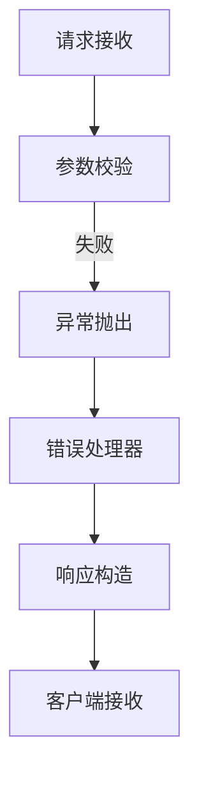

```markdown
# API错误信息泄露漏洞深度解析

## 1. 漏洞定义与影响
### 1.1 基本概念
API错误信息泄露（Error Message Leakage）是指应用程序接口在异常处理过程中，向客户端返回包含敏感技术细节的错误响应。这些信息可能包括：
- 堆栈跟踪（Stack Trace）
- 数据库连接凭证
- 服务器内部路径
- 调试日志
- 代码片段
- 第三方服务密钥

### 1.2 威胁评估
根据OWASP API Security Top 2023，错误信息泄露位列API安全风险前五名。其影响包括：
1. 攻击面暴露：泄露的架构信息可辅助攻击者制定精准攻击方案
2. 漏洞链构建：结合其他漏洞（如SQL注入）形成攻击矩阵
3. 信任度损失：影响企业技术声誉和合规性（GDPR/HIPAA）

## 2. 技术原理分析
### 2.1 错误处理机制
典型API错误响应流程：


### 2.2 信息泄露途径
| 泄露类型         | 常见来源                  | 风险等级 |
|------------------|-------------------------|--------|
| 堆栈跟踪         | 未捕获异常               | 高危   |
| 数据库错误       | ORM框架原生响应          | 严重   |
| 文件系统路径     | 文件操作异常             | 中高   |
| 内存转储         | 核心转储文件暴露         | 致命   |
| 调试信息         | 生产环境调试模式启用     | 严重   |

## 3. 错误信息分类与案例
### 3.1 结构化错误泄露
```json
// 危险示例
{
  "error": {
    "code": "DB_CONN_FAIL",
    "message": "PostgreSQL连接失败: host=db-prod.pgserver.com port=5432",
    "stack": "at DataSource.init()...",
    "timestamp": "2023-08-20T14:32:18Z"
  }
}
```
此响应暴露了数据库服务器地址、服务端口和连接时序信息。

### 3.2 非结构化错误泄露
```http
HTTP/1.1 500 Internal Server Error
Content-Type: text/plain

java.sql.SQLException: Access denied for user 'admin'@'10.2.3.4' (using password: YES)
	at com.mysql.cj.jdbc.MysqlIO.checkErrorPacket(MysqlIO.java:456)
	at com.mysql.cj.jdbc.MysqlIO.checkErrorPacket(MysqlIO.java:885)
	...
```
暴露数据库类型、认证凭证、代码调用栈等信息。

## 4. 攻击向量与利用技术
### 4.1 信息收集阶段
通过构造非常规请求触发错误：
```bash
curl -X POST https://api.example.com/v1/users \
  -H "Content-Type: application/json" \
  -d '{"id": "100\0xDEADBEEF"}'
```
可能引发序列化错误，暴露框架类型和版本信息。

### 4.2 漏洞组合利用
案例：通过错误信息获取数据库类型后实施SQL注入：
1. 触发数据库超时错误获取DB类型
2. 根据数据库特性构造延时注入payload
3. 通过响应时间差异提取数据

```sql
SELECT * FROM users WHERE id = 1; WAITFOR DELAY '0:0:5'--
```

### 4.3 路径遍历攻击
从错误信息中提取文件系统路径：
```http
GET /api/download?file=../../etc/passwd HTTP/1.1

HTTP/1.1 500 Internal Server Error
{"error": "File not found: /var/app/config/../../etc/passwd"}
```

## 5. 深度检测方法论
### 5.1 黑盒检测流程
```python
def test_error_leakage(url):
    test_cases = [
        ("GET", "/invalid-endpoint", 404),
        ("POST", "/auth", {"":""}),
        ("GET", "/users?page=INVALID")
    ]
    for method, path, payload in test_cases:
        res = requests.request(method, url+path, json=payload)
        analyze_response(res)

def analyze_response(response):
    indicators = [
        "Exception",
        "at com.",
        "mysql_connect()",
        "Traceback",
        "Error Code:"
    ]
    if any(indicator in response.text for indicator in indicators):
        log_vulnerability(response)
```

### 5.2 灰盒检测要点
1. 检查异常处理中间件配置
2. 审计全局错误处理器实现
3. 验证生产环境调试模式关闭
4. 审查第三方库的默认错误响应

## 6. 防御策略与实践
### 6.1 分层防护体系
#### 应用层防御
```java
// Spring Boot示例：自定义错误处理器
@ControllerAdvice
public class ApiExceptionHandler {

    @ExceptionHandler(Exception.class)
    public ResponseEntity<ErrorResponse> handleAllExceptions(Exception ex) {
        ErrorResponse error = new ErrorResponse(
            "API_500",
            "服务器处理请求时发生错误",
            ZonedDateTime.now(ZoneOffset.UTC)
        );
        return new ResponseEntity<>(error, HttpStatus.INTERNAL_SERVER_ERROR);
    }
}

// 标准化错误响应结构
public class ErrorResponse {
    private String code;
    private String message;
    private ZonedDateTime timestamp;
    // 排除stackTrace等敏感字段
}
```

#### 基础设施层防护
1. 配置反向代理统一错误页面
```nginx
server {
    error_page 500 /error/500.json;
    location = /error/500.json {
        internal;
        return 500 '{"code":"GENERIC_ERROR"}';
    }
}
```

### 6.2 深度防御措施
| 防护层级       | 具体措施                                  |
|----------------|-----------------------------------------|
| 代码层         | 全局异常处理器+错误响应标准化            |
| 配置层         | 禁用调试模式，配置安全HTTP头             |
| 架构层         | API网关统一错误格式化                     |
| 监控层         | 异常模式分析+敏感信息告警                 |
| 测试层         | 模糊测试覆盖非常规输入场景                |

### 6.3 高级防护建议
1. 动态错误抑制：根据请求来源IP信誉度控制错误详情展示
2. 错误信息混淆：对技术细节进行加密或哈希处理（需配合日志分析系统）
3. 上下文感知过滤：在错误响应中自动移除以下内容：
   - 服务器IP地址
   - 数据库连接字符串
   - 内部服务DNS名称
   - 文件系统绝对路径

## 7. 总结与建议
API错误信息泄露作为隐蔽性高但危害严重的漏洞，需要开发团队和安全团队协同防护。建议采用以下综合方案：

1. **开发规范**
   - 强制实施错误响应标准化
   - 建立异常分类白名单机制
   - 代码审查重点关注异常传播路径

2. **运维配置**
   - 生产环境严格禁用调试模式
   - 配置应用服务器安全错误页
   - 启用HTTP安全头（如X-Content-Type-Options）

3. **持续监控**
   - 部署错误日志分析系统
   - 建立异常响应模式基线
   - 实施实时敏感信息告警

4. **防御纵深**
   - 在API网关层实施二次过滤
   - 定期进行模糊测试
   - 关键服务部署运行时应用自保护（RASP）

通过构建覆盖SDLC全周期的防护体系，可有效降低错误信息泄露风险，提升API整体安全性。建议参考OWASP API Security Top 10和NIST SP 800-204标准建立企业级防护规范。
```

---

*文档生成时间: 2025-03-13 15:59:30*
