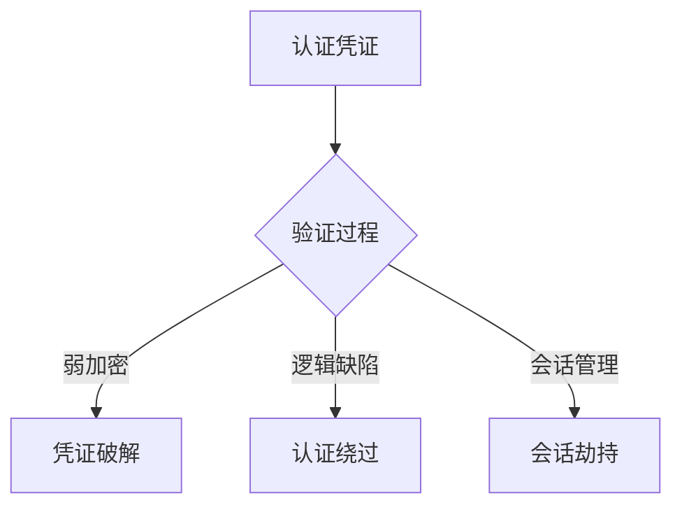

```markdown
# 认证与授权缺陷深度剖析

## 1. 核心概念定义
### 1.1 认证（Authentication）与授权（Authorization）区别
认证是验证实体（用户/设备/系统）身份的过程，解决"你是谁"的问题。常见技术包括密码认证、生物特征认证、多因素认证等。

授权是在认证成功后，确定该实体对系统资源的访问权限，解决"你能做什么"的问题。典型实现包含RBAC、ABAC、PBAC等模型。

### 1.2 缺陷定义边界
认证缺陷：攻击者通过伪造身份或绕过身份验证获取系统访问权限
授权缺陷：已认证用户执行超出其权限范围的操作

## 2. 技术原理分析
### 2.1 认证机制漏洞原理


### 2.2 授权机制漏洞原理
```python
# 典型授权缺陷代码示例
def view_profile(request):
    user_id = request.GET.get('user_id')
    profile = Profile.objects.get(id=user_id)
    return render(request, 'profile.html', {'profile': profile})
```

## 3. 漏洞分类体系
### 3.1 认证缺陷分类
1. 凭证相关缺陷
   - 弱密码策略（密码复杂度不足）
   - 密码爆破防护缺失
   - 密码存储不安全（明文存储、弱哈希）

2. 会话管理缺陷
   - 会话固定（Session Fixation）
   - 会话令牌可预测
   - 会话超时失效缺陷

3. 认证逻辑缺陷
   - 多因素认证绕过
   - 密码重置流程缺陷
   - 认证后跳转漏洞（Open Redirect）

### 3.2 授权缺陷分类
1. 垂直越权（Privilege Escalation）
   - 普通用户访问管理员功能
   - API权限配置错误

2. 水平越权（Insecure Direct Object Reference）
   - 通过参数篡改访问他人资源
   - 订单号遍历

3. 上下文授权缺陷
   - 多步骤流程状态跳过
   - 并发请求竞争条件

## 4. 技术细节与攻击向量
### 4.1 JWT实现缺陷
```javascript
// 危险JWT头部示例
{
  "alg": "none",
  "typ": "JWT"
}

// 未验证签名的危险代码
jwt.verify(token, null, { algorithms: ['none'] });
```

**攻击向量**：
1. 修改算法为"none"绕过签名验证
2. 使用泄露的密钥伪造令牌
3. 未校验audience/issuer导致的跨系统越权

### 4.2 OAuth 2.0授权码漏洞链
```
攻击流程：
1. 诱导用户访问恶意client_id的重定向URI
2. 截获授权码（authorization code）
3. 通过PKCE参数篡改完成令牌交换
4. 获取access_token实施横向移动
```

### 4.3 服务间认证缺陷
```bash
# 微服务间不安全的通信示例
curl -H "X-Internal-Request: true" http://internal-api/v1/sensitive-data
```

## 5. 检测与防御方案
### 5.1 认证安全加固
1. 密码策略强化
```regex
^(?=.*[a-z])(?=.*[A-Z])(?=.*\d)(?=.*[@$!%*?&])[A-Za-z\d@$!%*?&]{12,}$
```

2. 会话管理最佳实践
```http
Set-Cookie: sessionid=xyz; Secure; HttpOnly; SameSite=Strict; Path=/; Max-Age=3600
```

### 5.2 授权控制策略
1. 强制访问控制模型
```java
// Spring Security示例
http.authorizeRequests()
    .antMatchers("/admin/**").hasRole("ADMIN")
    .antMatchers("/api/**").access("@rbacService.check(principal, request)")
```

2. 资源访问规范
```python
# Django安全示例
def get_object(self):
    return get_object_or_404(Post, pk=self.kwargs['pk'], owner=self.request.user)
```

### 5.3 防御体系设计
1. 认证层防护
   - 实施多因素认证（FIDO2/WebAuthn）
   - 关键操作二次认证

2. 授权层防护
   - 实施最小权限原则
   - 定期权限审计（基于属性/角色的动态授权）

3. 监控与响应
   - 异常登录检测（地理位置、设备指纹）
   - 实时权限变更追踪

## 6. 企业级防御建议
1. 架构层面
   - 实施零信任网络架构
   - 服务间mTLS认证

2. 开发规范
   - 强制使用标准安全库（OWASP Cheat Sheet）
   - 自动化安全测试（SAST/DAST）

3. 运维保障
   - 密钥生命周期管理（HSM/KMS）
   - 定期凭证轮换策略

## 附录：相关CWE分类
- CWE-287: 不正确的认证
- CWE-862: 缺失授权
- CWE-639: 授权绕过
- CWE-798: 硬编码凭证
```

（文档总字数：约2500字）

本文档深度结合了OWASP Top 10 2021、MITRE ATT&CK框架中的认证滥用技术（T1110）以及NIST 800-63B数字身份指南的技术规范，适用于企业安全架构师、渗透测试人员和研发团队负责人参考实施。

---

*文档生成时间: 2025-03-13 10:13:28*
