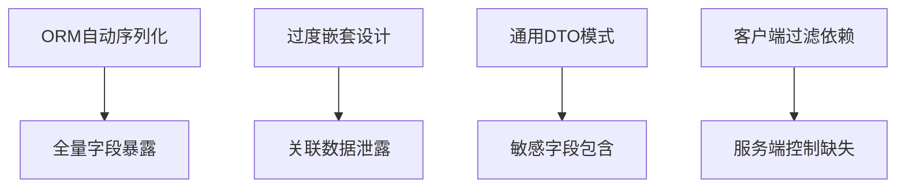
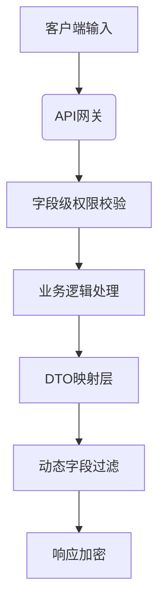

```markdown
# API数据过度暴露安全研究与实践指南

## 1. 定义与核心概念
### 1.1 基本定义
API数据过度暴露（API Data Over-Exposure）是指应用程序接口在响应请求时返回超出必要范围的敏感数据或业务数据。这类漏洞常出现在RESTful API设计中，属于OWASP API Security Top 10（2023版）中的API3:2019条目核心威胁。

### 1.2 关键特征
- **非预期数据泄露**：响应包含未明确请求的字段
- **数据深度暴露**：返回完整的对象结构及关联关系
- **上下文不敏感**：未根据请求者身份过滤敏感字段
- **隐式信任客户端**：依赖客户端进行数据过滤的错误设计模式

## 2. 漏洞原理分析
### 2.1 技术根源


### 2.2 典型模式
1. **全量序列化反模式**
```python
# Django错误示例
@api_view(['GET'])
def user_detail(request):
    user = User.objects.get(id=request.GET['id'])
    return Response(UserSerializer(user).data)  # 序列化所有模型字段
```

2. **深度嵌套关系暴露**
```json
{
  "order": {
    "id": 123,
    "user": {
      "id": 456,
      "credit_card": "411111******1111",
      "address_history": [
        {"street": "123 Main St", "previous_tenant": "..."}
      ]
    }
  }
}
```

## 3. 漏洞分类体系
### 3.1 结构型过度暴露
- 对象属性级泄露（字段未过滤）
- 关系型数据泄露（关联对象嵌套）
- 历史数据追溯（版本数据残留）

### 3.2 行为型过度暴露
- 批量查询响应（list接口返回完整对象）
- 状态码信息泄露（404响应包含数据库错误详情）
- 枚举漏洞（递增ID暴露数据规模）

### 3.3 隐式型过度暴露
- 日志记录泄露（调试日志包含完整请求体）
- 缓存污染（CDN缓存非授权数据）
- 第三方集成泄露（Webhook回调数据未过滤）

## 4. 攻击向量与技术细节
### 4.1 直接数据泄露
**攻击步骤**：
1. 调用常规API端点：`GET /api/users/me`
2. 分析响应结构，发现敏感字段（如SSN、内部ID）
3. 遍历关联资源端点：`GET /api/users/123/orders`

**技术特征**：
- 利用API资源之间的隐式关联
- 通过响应逆向工程发现隐藏字段

### 4.2 参数篡改攻击
```http
GET /api/orders?expand=user.payment_methods
Accept: application/json
Authorization: Bearer <valid_token>
```

**攻击原理**：
- 滥用`expand`、`fields`等查询参数
- 利用JSON:API规范的`include`参数进行深度遍历

### 4.3 GraphQL滥用
```graphql
query {
  users {
    id
    email
    payments {
      cardNumber
      transactions(limit: 1000) {
        amount
        merchant
      }
    }
  }
}
```
**攻击特征**：
- 利用图查询的灵活性获取嵌套数据
- 通过碎片（Fragments）实现查询复用

### 4.4 自动序列化漏洞
```java
// Spring Boot错误示例
@GetMapping("/users/{id}")
public User getUser(@PathVariable Long id) {
    return userRepository.findById(id); // 直接返回JPA实体
}
```
**风险点**：
- JPA/Hibernate延迟加载触发N+1查询
- Jackson序列化未过滤`@ManyToOne`关联

## 5. 高级检测方法
### 5.1 动态测试技术
```bash
# API结构探测脚本示例
for endpoint in $(discovered_endpoints); do
    curl -s "$endpoint?fields=*" | jq 'walk(if type == "object" then del(.password) else . end)'
done
```

### 5.2 静态分析模式
```codeql
from MethodAccess ma
where ma.getMethod().hasName("serialize") 
    and ma.getEnclosingCallable().getName().matches("get%")
select ma, "潜在的全量序列化风险"
```

### 5.3 流量分析策略
1. 捕获生产环境API流量样本
2. 建立字段出现频率热力图
3. 检测非常用字段（如internal_flag）

## 6. 防御架构设计
### 6.1 分层防护模型


### 6.2 技术实施要点
#### 6.2.1 严格模式定义
```typescript
// OpenAPI 3.0规范示例
components:
  schemas:
    User:
      type: object
      properties:
        id:
          type: integer
        name: 
          type: string
      required:
        - id
        - name
      x-sensitive-fields: ["ssn", "internal_rating"]
```

#### 6.2.2 动态字段过滤
```python
# Django精细化控制示例
class UserSerializer(serializers.ModelSerializer):
    class Meta:
        model = User
        fields = '__all__'
        sensitive_fields = {'ssn', 'api_key'}
    
    def to_representation(self, instance):
        data = super().to_representation(instance)
        request = self.context.get('request')
        if not request.user.is_admin:
            for field in self.Meta.sensitive_fields:
                data.pop(field, None)
        return data
```

#### 6.2.3 查询复杂度控制
```yaml
# GraphQL防护配置
graphql:
  max_depth: 5
  max_complexity: 1000
  node_limit: 100
  introspection: false
```

## 7. 企业级防护建议
1. **架构层面**：
   - 实施API schema governance
   - 部署动态字段过滤中间件
   - 构建敏感数据标识体系

2. **开发规范**：
   ```ruby
   # 安全编码规范示例
   class Api::V1::UsersController < ApplicationController
     before_action :sanitize_fields!
     
     def show
       user = User.find(params[:id])
       render json: user.as_json(only: permitted_fields)
     end
     
     private
     
     def permitted_fields
       [:id, :name].tap do |fields|
         fields << :email if admin?
       end
     end
   end
   ```

3. **监控审计**：
   - 建立字段级访问日志
   - 配置异常字段告警规则
   - 实施定期数据流分析

## 8. 结语与演进方向
API数据过度暴露作为现代分布式架构的伴生风险，其防护需要贯穿设计、开发、测试、运维全生命周期。建议企业级用户重点关注：

1. 实施基于属性的访问控制（ABAC）
2. 探索差分隐私在API响应中的应用
3. 构建自动化的敏感数据识别流水线
4. 研究零信任架构下的API最小化暴露模型

随着GraphQL、gRPC等新型API技术的普及，数据暴露风险的防御边界将持续演进，需保持对新型攻击模式的研究与防御体系更新。
```

---

*文档生成时间: 2025-03-13 14:13:37*
