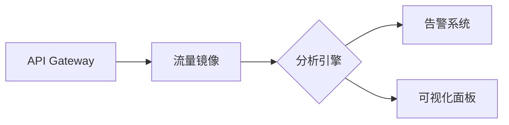

---
# API数据过度暴露的检测与监控方法及工具

## 一、API数据过度暴露概述
API数据过度暴露（API Data Over-Exposure）是Web安全领域中的常见漏洞，指API接口返回超出业务需求的敏感数据（如用户隐私、系统配置等），导致攻击者可通过逆向工程或枚举攻击获取非授权信息。此类问题通常源于开发阶段缺乏数据最小化原则的实践，或未对响应字段进行精细化控制。

---

## 二、检测方法与技术

### 1. 静态代码分析
**原理**：通过扫描API服务端代码和配置文件，识别未过滤的敏感字段或过度开放的响应模型。

**工具示例**：
- **Checkmarx/Veracode**：识别代码中直接暴露数据库字段的ORM操作（如`SELECT * FROM users`）
- **Semgrep**：自定义规则检测DTO（Data Transfer Object）类中未标记`@JsonIgnore`的敏感字段

**实施步骤**：
1. 建立敏感字段关键词库（如password、SSN、credit_card）
2. 扫描代码中未过滤敏感数据的API端点
3. 验证返回对象与前端需求的匹配度

### 2. 动态流量测试
**原理**：通过模拟客户端请求，分析API响应内容是否包含冗余数据。

**工具链**：
- **Postman/Insomnia**：手动构造请求并检查响应体结构
- **OWASP ZAP**：自动化扫描API端点，生成数据暴露风险报告
- **Burp Suite**：通过Intruder模块批量测试参数组合，观察数据泄露模式

**测试案例**：
```http
GET /api/users/123
响应：
{
  "id": 123,
  "name": "John Doe",
  "email": "john@example.com",
  "internal_id": "EMP-2023",  // 过度暴露的内部标识符
  "password_hash": "a1b2c3..." // 严重敏感字段泄露
}
```

### 3. 模糊测试（Fuzzing）
**原理**：向API发送异常参数触发意外数据返回，例如：
- 修改路径参数：`GET /api/users/-1`
- 注入特殊字符：`GET /api/users/123?fields=*`

**工具推荐**：
- **RESTler**：微软开发的自动化API模糊测试工具，支持智能生成测试用例
- **APIFuzzer**：基于AI的上下文感知测试框架

### 4. 权限边界验证
**方法**：横向越权测试（Horizontal Privilege Escalation）
1. 使用低权限账户A获取资源ID
2. 尝试用账户B访问同一资源ID的API端点
3. 检查响应是否包含B账户不应看到的数据

---

## 三、监控方法与实施

### 1. 实时流量分析
**架构设计**：


**关键指标**：
- 敏感字段出现频率（如身份证号、手机号）
- 响应体大小异常波动（如单用户查询返回1000条记录）
- HTTP状态码分布（403/404比例突增可能表示枚举攻击）

### 2. 敏感数据识别引擎
**技术栈**：
- **正则表达式匹配**：识别已知数据格式（信用卡号、手机号）
  ```regex
  \b(?:\d{4}[ -]?){3}\d{4}\b  # 信用卡号识别
  ```
- **机器学习模型**：使用NLP技术检测非结构化数据中的敏感信息
- **数据分类标签**：对API字段进行PII（个人身份信息）分级标注

### 3. 行为基线建模
**实施步骤**：
1. 收集30天正常流量样本
2. 建立参数分布模型（如ID取值范围、字段组合模式）
3. 设置动态阈值告警（如单个IP每小时调用次数>500次）

**异常场景示例**：
- 短时间内大量`GET /api/users/{id}`请求，ID呈连续递增
- 同一客户端频繁请求不同地区的资源数据

### 4. 日志关联分析
**ELK Stack应用**：
```bash
# 示例KQL查询异常日志
apm.response.body_size > 10KB 
| where http.url contains "/api/users" 
| stats count() by client_ip
| where count > 100
```

---

## 四、专用工具详解

### 1. 商业解决方案
- **Akamai API Security**：提供实时敏感数据流地图，支持GDPR/CCPA合规审计
- **Salt Security**：利用AI分析API调用上下文，识别数据暴露链
- **Imperva API Protection**：自动生成数据访问基线策略

### 2. 开源工具
- **ModSecurity + CRS规则集**：部署自定义规则阻断过度暴露请求
  ```apache
  SecRule RESPONSE_BODY "@contains password_hash" 
  "id:1001,phase:4,deny,msg:'Sensitive field exposure'"
  ```
- **Elasticsearch Data Visualizer**：通过机器学习自动发现异常数据模式
- **Graylog**：构建日志告警规则关联WAF和API网关事件

---

## 五、最佳实践建议
1. **设计阶段**：采用OpenAPI规范明确定义响应模型，使用`readOnly`标记敏感字段
   ```yaml
   components:
     schemas:
       User:
         type: object
         properties:
           ssn:
             type: string
             readOnly: true
   ```
2. **开发阶段**：强制使用DTO模式转换数据，避免直接返回ORM实体
3. **测试阶段**：集成自动化检测到CI/CD流水线
   ```yaml
   # GitLab CI示例
   api_sec_test:
     image: zaproxy/zap-stable
     script:
       - zap-api-scan.py -t openapi.yaml -f openapi -r report.html
   ```
4. **运维阶段**：实施零信任策略，对所有API响应进行动态脱敏

---

## 六、案例研究
**某电商平台数据泄露事件**：
- **漏洞成因**：订单查询API返回完整的用户支付信息
- **检测过程**：通过Burp Suite历史流量分析发现`/api/orders`响应包含CVV码
- **修复方案**：
  1. 重构DTO层过滤`payment_details`字段
  2. 部署WAF规则拦截包含`cvv`的响应内容
  3. 启用Datadog APM监控响应体大小异常

---

## 七、未来趋势
1. **GraphQL专项检测**：针对`__schema`查询和过度嵌套查询的监控方案
2. **隐私计算集成**：在API网关层实现同态加密，避免原始数据暴露
3. **标准化框架推进**：参与OWASP API Security Top 10社区，贡献检测规则库

通过结合自动化工具与深度防御策略，企业可构建覆盖API全生命周期的数据暴露防护体系。建议每季度执行红蓝对抗演练，持续优化监控规则库。

---

*文档生成时间: 2025-03-13 14:35:40*


