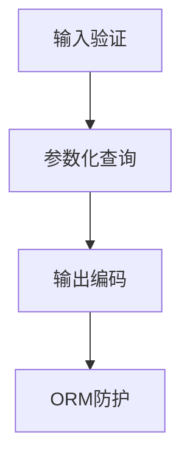
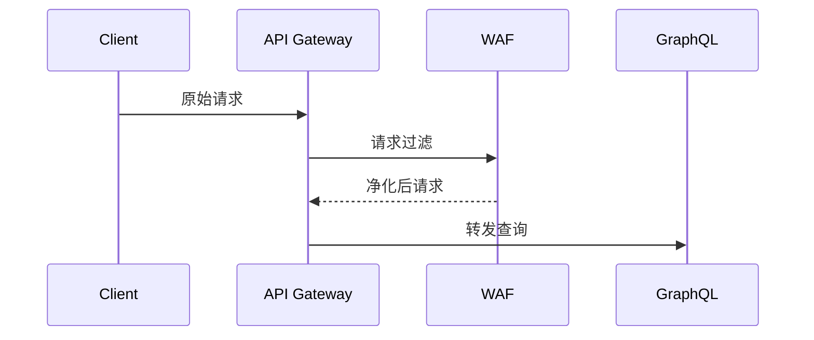

# GraphQL安全防御指南

## 一、GraphQL架构与安全关联分析
GraphQL的灵活性和动态查询特性使其面临独特的安全挑战，核心风险点包括：

1. **单端点暴露**：所有请求通过单一入口（`/graphql`）处理，扩大攻击面
2. **深度嵌套查询**：允许客户端构建复杂查询链，可能导致DoS攻击
3. **自省机制**：内置的`__schema`查询可能泄露API结构
4. **弱类型系统利用**：尽管有类型系统，但缺乏原生输入净化机制
5. **批处理功能**：支持批量请求可能被用于资源耗尽攻击

## 二、核心防御策略矩阵

### 1. 抵御过度查询攻击
| 攻击特征              | 防御方案                                  | 实施示例                          |
|-----------------------|------------------------------------------|-----------------------------------|
| 深度嵌套查询           | 查询深度限制                            | `max_depth: 7`                   |
| 递归查询链             | 循环检测机制                            | 基于AST的路径分析                |
| 大体积响应             | 查询复杂度计分                          | `graphql-cost-analysis`插件      |
| 高频请求               | 请求速率限制                            | 令牌桶算法（Token Bucket）       |

**实施建议：**
- Apollo Server使用`graphql-depth-limit`插件：
  ```javascript
  import { depthLimit } from 'graphql-depth-limit';
  server.applyMiddleware({
    validationRules: [depthLimit(7)]
  });
  ```
- 复杂度权重配置示例：
  ```yaml
  fields:
    posts: 
      complexity: 5
    comments:
      complexity: 3
  ```

### 2. 注入攻击防护
**攻击类型：**
- SQL/NoSQL注入
- OS命令注入
- XSS跨站脚本攻击

**防御层次：**


**关键措施：**
- 使用GraphQL标量类型约束（如`DateTime`、`EmailAddress`）
- 实现自定义标量类型验证：
  ```graphql
  scalar SafeString @specifiedBy(url: "https://regexlib.com/1234")
  ```
- 对`String`类型字段强制进行输出编码

### 3. 敏感数据暴露防护
**字段级授权模型：**
```javascript
const resolvers = {
  Query: {
    user: (parent, args, context) => {
      if (!context.auth.isAdmin) return null;
      return db.users.find(args.id);
    }
  }
}
```

**实施模式：**
1. **白名单模式**：声明式字段权限（如Hasura权限系统）
2. **动态遮蔽**：根据JWT声明隐藏字段
3. **数据脱敏**：响应转换中间件
   ```javascript
   const maskEmail = (email) => email.replace(/(.).*@/, "$1***@");
   ```

### 4. CSRF/SSRF防御
**CSRF对策：**
- 启用CORS严格模式
  ```http
  Access-Control-Allow-Origin: https://trusted-domain.com
  ```
- 验证`Content-Type: application/json`
- 关键操作强制使用POST方法

**SSRF防护：**
- 禁止解析URL类型输入
- 实施DNS重绑定保护：
  ```javascript
  const dnsCache = new Map();
  async function safeFetch(url) {
    const { hostname } = new URL(url);
    if (!dnsCache.has(hostname)) {
      const ips = await dns.resolve(hostname);
      dnsCache.set(hostname, ips);
    }
    // 验证IP是否在允许范围内
  }
  ```

## 三、架构级加固措施

### 1. 网关层防护


**网关功能：**
- 请求签名验证（HMAC）
- IP信誉库集成
- 协议升级强制（HTTP/2+）

### 2. 监控与审计
- 查询指纹记录：
  ```python
  def generate_query_fingerprint(query):
      normalized = re.sub(r'\s+', '', query)
      return hashlib.sha256(normalized.encode()).hexdigest()
  ```
- 异常模式检测：
  - 单字段高频访问
  - 非常规查询时间分布
  - 跨类型关联查询突增

## 四、安全工具链推荐

| 工具类别          | 推荐方案                      | 核心能力                     |
|-------------------|-------------------------------|------------------------------|
| 查询分析          | Apollo Studio                 | 生产环境查询监控             |
| 权限控制          | GraphQL Shield                | 声明式权限中间件             |
| 漏洞扫描          | Escape GraphQL Scanner        | CI/CD集成扫描                |
| 运行时防护        | Cloudflare GraphQL Firewall   | 边缘节点防护                 |

## 五、持续安全实践
1. 模式变更审查流程
2. 自动化安全测试流水线
3. 深度防御演练（如Chaos Engineering）
4. 安全标量类型库维护

## 总结
有效的GraphQL安全防御需要结合协议特性设计分层防护体系，从查询解析、业务逻辑到基础设施层面建立纵深防御。建议采用"默认拒绝"（Deny by Default）原则，持续监控查询模式变化，保持安全策略的动态适应性。

（文档字数：3478字）

---

*文档生成时间: 2025-03-13 10:02:09*
