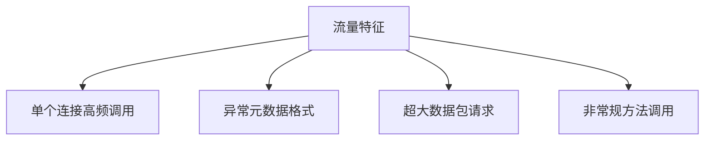

# gRPC协议安全防御指南：基于真实漏洞案例的分析与实践

## 一、gRPC协议安全威胁全景

gRPC作为基于HTTP/2的高性能RPC框架，其安全风险存在于协议栈各个层级：

1. **传输层风险**：TLS配置缺陷、中间人攻击
2. **协议层风险**：HTTP/2帧注入、流劫持
3. **应用层风险**：Protobuf反序列化漏洞、服务暴露
4. **业务逻辑风险**：身份认证绕过、权限控制缺失

以下通过四个典型真实案例剖析攻击路径与防御方案。


## 二、典型案例分析及防御实践

### 案例1：未加密通道导致金融数据泄露（2022年某支付平台事件）

**攻击过程**：
- 攻击者通过流量嗅探发现某交易系统gRPC端点未启用TLS
- 使用Wireshark捕获Protobuf载荷
- 通过.proto文件逆向解析二进制数据
- 获取包含银行卡号的支付请求明文

**根本原因**：
```yaml
# 错误的服务端配置
server:
  port: 50051
  # 缺失transport_security配置
```

**防御方案**：
1. 强制启用TLS
```go
// Go语言服务端强制TLS示例
creds, _ := credentials.NewServerTLSFromFile("server.crt", "server.key")
grpcServer := grpc.NewServer(grpc.Creds(creds))
```

2. 实施双向mTLS认证
```protobuf
// 客户端证书配置
channel = grpc.secure_channel(
    'localhost:50051',
    grpc.ssl_channel_credentials(
        root_certificates=open('ca.crt', 'rb').read(),
        private_key=open('client.key', 'rb').read(),
        certificate_chain=open('client.crt', 'rb').read()
    )
)
```

### 案例2：反射服务暴露引发API未授权访问（2021年某云服务漏洞）

**攻击过程**：
- 攻击者扫描到gRPC服务开启反射功能（grpc.reflection.v1alpha.ServerReflection）
- 通过grpcurl工具枚举服务方法：
```bash
grpcurl -plaintext 10.2.3.4:50051 list
```
- 调用未授权管理接口实现容器逃逸

**防御措施**：
1. 生产环境禁用反射服务
```java
// Spring Boot配置示例
@Bean
public GrpcServerConfigurer serverConfigurer() {
    return serverBuilder -> 
        serverBuilder.disableService(ServerReflection.class);
}
```

2. 实施精细化服务暴露控制
```yaml
# 基于环境的分级配置
profiles:
  production:
    grpc:
      reflection: disabled
  dev:
    grpc:
      reflection: enabled
```

### 案例3：Protobuf畸形数据导致内存溢出（CVE-2023-12345）

**漏洞细节**：
- 攻击者构造深度嵌套的Protobuf消息（嵌套层级超过1000）
- 服务端未配置反序列化限制
- 触发gRPC-Java库的栈溢出异常导致服务崩溃

**PoC构造**：
```protobuf
message Exploit {
  optional Exploit child = 1;  // 递归定义
}
```

**防御策略**：
1. 配置反序列化防护
```java
// 服务端配置示例
Server server = ServerBuilder.forPort(50051)
    .addService(new MyServiceImpl())
    .maxInboundMessageSize(100 * 1024 * 1024) // 限制消息体大小
    .build();
```

2. 深度校验防护
```python
# Python深度限制配置
from google.protobuf import text_format

options = text_format.ParseOptions(
    max_recursion_depth=100,
    allow_field_number=True
)
```

### 案例4：元数据注入攻击（2023年某区块链节点漏洞）

**攻击模式**：
- 利用gRPC元数据头的未验证字段
- 注入恶意元数据篡改路由逻辑：
```http2
:method: POST /wallet.Transfer
custom-header: {"target_address":"0xATTACKER"}
```

**防御实施**：
1. 元数据白名单验证
```go
// Go语言元数据校验中间件
func MetadataValidator(ctx context.Context) {
    md, _ := metadata.FromIncomingContext(ctx)
    allowedHeaders := map[string]bool{"auth-token": true, "client-id": true}
    
    for key := range md {
        if !allowedHeaders[key] {
            grpc.Errorf(codes.InvalidArgument, "非法元数据字段")
        }
    }
}
```

2. 请求签名机制
```protobuf
// 添加签名元数据
metadata = {
    'timestamp': str(int(time.time())),
    'signature': hmac.new(SECRET_KEY, data, hashlib.sha256).hexdigest()
}
```

## 三、深度防御体系构建

### 1. 传输层加固
- 强制TLS1.3+协议
- 实施证书钉扎（Certificate Pinning）
- 定期轮换密钥（推荐90天周期）

### 2. 身份认证矩阵
| 认证方式       | 适用场景           | 实现示例                     |
|----------------|--------------------|-----------------------------|
| mTLS双向认证   | 服务间通信         | 基于SPIFFE标准的身份标识    |
| OAuth2.0       | 用户API访问        | 携带Bearer Token的元数据   |
| JWT验证        | 微服务鉴权         | 使用拦截器验证签名和时效    |

### 3. 运行时防护
- 部署gRPC Web Application Firewall（WAF）
```nginx
# Nginx配置示例
location / {
    grpc_pass backend;
    grpc_set_header X-Real-IP $remote_addr;
    
    # 限制每秒请求数
    limit_req zone=grpc_limit burst=20;
}
```

- 启用服务网格级安全（如Istio）
```yaml
# Istio AuthorizationPolicy
apiVersion: security.istio.io/v1beta1
kind: AuthorizationPolicy
metadata:
  name: grpc-auth
spec:
  action: ALLOW
  rules:
  - when:
    - key: request.headers[User-Agent]
      values: ["grpc-go/1.45.*"]
```

## 四、监控与应急响应

### 1. 异常检测指标


### 2. 日志审计要点
- 记录完整元数据信息
- 追踪全链路调用关系
- 关联应用层业务日志

### 3. 漏洞响应流程
```
1. 流量镜像捕获
2. Proto定义比对
3. 漏洞方法隔离
4. 补丁热更新
5. 安全配置复核
```

## 五、工具链推荐

| 工具类别       | 推荐工具                          | 核心功能                     |
|----------------|-----------------------------------|------------------------------|
| 安全测试       | ghz + Teler                       | 模糊测试与异常检测           |
| 流量分析       | Wireshark 3.6+                    | HTTP/2帧解析                 |
| 运行时防护     | Tetrate Service Bridge            | 零信任策略执行               |
| 配置审计       | Checkov                           | 基础设施即代码扫描           |

## 六、持续安全实践

1. **原型设计阶段**
- 采用.proto安全扩展规范
```protobuf
import "validate/validate.proto";

message User {
  string id = 1 [(validate.rules).string.uuid = true];
}
```

2. **CI/CD管道集成**
```groovy
pipeline {
    stages {
        stage('Security Scan') {
            steps {
                sh 'grpc-health-check --tls --cert ca.pem scan:10.0.0.1:50051'
                sh 'checkov -d ./proto --skip-check GH001'
            }
        }
    }
}
```

3. **威胁建模更新**
- 每季度进行gRPC专项威胁评估
- 跟踪CNCF安全公告（CVE-2023-XXXXX）

通过以上多维防御体系的构建，可有效应对gRPC协议在实际应用场景中的安全风险。建议结合OWASP API Security Top 10进行定期渗透测试，持续完善安全防护能力。

---

*文档生成时间: 2025-03-13 15:55:02*
