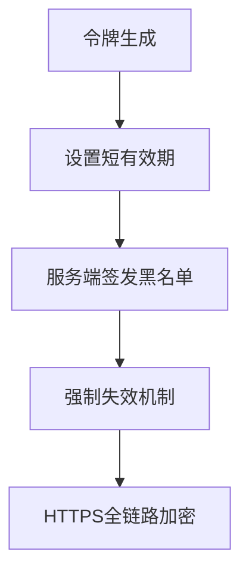

# JWT令牌安全防御指南（基本概念篇）

## 一、概述
JSON Web Token（JWT）作为现代Web应用广泛采用的授权机制，其安全性直接关系到系统整体的防护能力。本指南围绕JWT的基本安全原理、潜在风险类型及防御策略进行系统性阐述。

---

## 二、JWT结构解析与安全关联
### 1. 令牌结构
典型JWT由三部分构成：
- **Header**：声明令牌类型（typ）和签名算法（alg）
- **Payload**：包含声明（claims）的主体数据
- **Signature**：基于前两部分生成的防篡改签名

安全关联：每个组件的完整性保护是JWT安全的核心，其中算法选择和签名实现方式直接影响令牌的可信度。

### 2. 关键安全原理
- **签名不可伪造性**：依赖HMAC或非对称加密算法确保令牌内容不被篡改
- **声明验证强制性**：服务端必须验证签名、有效期（exp）、生效时间（nbf）等核心声明
- **密钥管理隔离性**：签名密钥与业务逻辑分离存储，避免硬编码泄露

---

## 三、JWT类型与安全特性
| 类型          | 技术特征                          | 安全风险场景                     |
|---------------|-----------------------------------|----------------------------------|
| JWS（签名令牌）| 仅对Header+Payload进行签名        | 弱算法导致签名破解               |
| JWE（加密令牌）| 对Payload进行加密传输             | 密钥泄露导致数据解密             |
| Unsecured JWT | 无签名（alg=none）                | 直接篡改令牌内容                 |

---

## 四、核心安全威胁
### 1. 算法漏洞攻击
- 弱算法（HS256弱密钥、RS256密钥泄露）
- "none"算法绕过签名验证
- 算法混淆攻击（强制服务端使用非预期算法）

### 2. 声明篡改攻击
- 过期令牌重用（修改exp/nbf声明）
- 权限提升（修改role/user_id等声明）

### 3. 数据泄露风险
- Payload明文存储敏感信息（如密码、支付数据）
- 客户端存储泄露导致令牌被盗

### 4. 基础设施缺陷
- 密钥管理不当（版本控制缺失、未定期轮换）
- 验证逻辑缺失（未检查签名或声明）

---

## 五、防御实施指南
### 1. 算法选择策略
- 强制使用强算法（推荐RS256/ES256/PS256）
- 服务端白名单控制允许的alg参数
- 完全禁用"none"算法支持

```python
# 示例：Python解码时强制算法验证
jwt.decode(token, key, algorithms=["RS256"])
```

### 2. 声明验证规范
- 必验字段：exp、nbf、iss（签发者）、aud（受众）
- 自定义声明校验：建立角色白名单机制
- 时钟偏差补偿：设置grace period（建议≤30秒）

### 3. 密钥安全管理
- 非对称密钥存储：私钥仅保存在服务端安全模块（HSM/KMS）
- 密钥轮换方案：
  - 定期轮换（建议≤90天）
  - 异常事件触发式轮换
- 开发环境禁用生产密钥

### 4. 令牌生命周期控制


- 建议有效时长：前端令牌≤15分钟，刷新令牌≤24小时
- 服务端维护令牌吊销列表（针对提前失效场景）

### 5. 敏感数据处理
- 禁止在Payload存储：
  - 用户密码/PIN码
  - 信用卡CVV等支付凭证
  - 未加密的个人身份信息
- 敏感声明建议加密存储：
```json
{
  "ssn": "jwe_encrypted_data"
}
```

### 6. 客户端防护
- 浏览器存储策略：
  - 避免localStorage（XSS暴露风险）
  - 优先使用HttpOnly + Secure Cookie
- 移动端安全存储：
  - Android使用Keystore
  - iOS使用Keychain
- 防截获措施：绑定设备指纹/IP特征

---

## 六、补充防御建议
1. 输出编码保护：对JWT解码结果进行HTML编码，防御XSS
2. 日志脱敏处理：自动屏蔽日志中的完整JWT内容
3. 漏洞扫描集成：在CI/CD流程加入JWT安全检测
4. 标准化库使用：
   - 推荐：auth0/java-jwt, jose4j
   - 禁止：自行实现加密/签名逻辑

---

## 七、攻击检测指标
当出现以下特征时需启动安全审计：
- 单个用户令牌异常高频使用（≥3地域/IP切换）
- 含非常规声明（如admin=true）
- 使用已撤销的kid（密钥ID）
- 签名验证时间波动≥200ms（可能存在算法爆破）

通过实施本指南中的分层防御策略，可有效构建JWT令牌的全生命周期防护体系。建议每季度进行令牌安全审计，重点关注密钥管理状态和算法实现漏洞。

---

*文档生成时间: 2025-03-13 12:53:52*
