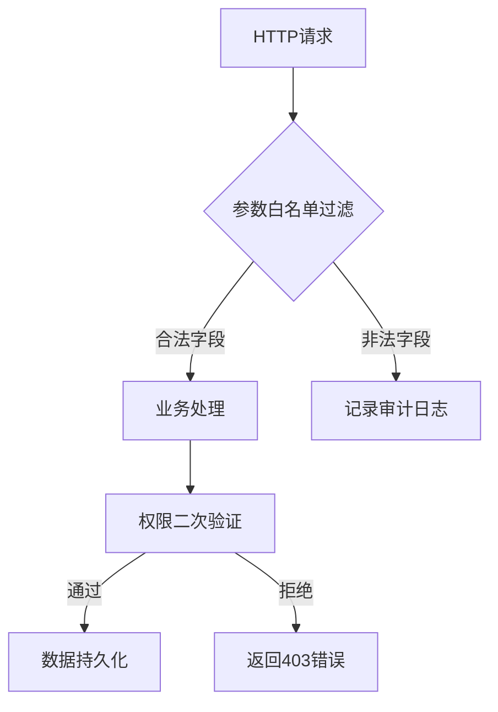

### 批量分配漏洞防御指南（Web安全方向）

#### 一、漏洞原理简述
批量分配漏洞（Mass Assignment Vulnerability）源于开发框架的自动化数据绑定机制。攻击者通过构造包含敏感字段的HTTP请求（如`is_admin`、`role`或`balance`），利用框架自动将请求参数映射到数据模型的特性，覆盖本应受保护的属性。典型场景包括用户注册、资料更新和API调用等数据持久化操作。

---

#### 二、核心防御策略

##### 1. 字段显式绑定（白名单机制）
**原理**：仅允许明确声明的字段参与数据绑定  
**实现**：
```java
// Spring框架示例
@PostMapping("/users")
public User createUser(@ModelAttribute("user") @AllowedFields({"username", "email"}) User user) {
    // 仅绑定username和email字段
}
```
```ruby
# Rails Strong Parameters
def user_params
  params.require(:user).permit(:username, :email)
end
```
**最佳实践**：
- 所有数据绑定操作必须声明允许字段列表
- 禁用框架的自动绑定功能（如Spring的`setAllowedFields`）
- 优先使用白名单而非黑名单机制

##### 2. 数据分层处理（DTO模式）
**原理**：通过中间传输对象隔离数据库模型  
**实现**：
```typescript
// 用户注册DTO
class UserCreateDTO {
  username: string;
  email: string;
  password: string;
}

// 实际用户模型
class UserEntity {
  id: number;
  username: string;
  email: string;
  password: string;
  is_admin: boolean;  // 不在DTO中暴露
}
```
**优势**：
- 物理隔离敏感字段
- 支持字段格式转换和校验
- 适配不同场景的数据视图

##### 3. 权限二次验证
**实现层级**：
```python
def update_profile(request):
    user = get_current_user()
    form = ProfileForm(request.POST, instance=user)
    if form.is_valid():
        # 显式检查是否尝试修改管理员字段
        if 'is_admin' in form.changed_data and not user.is_superuser:
            raise PermissionDenied
        form.save()
```
**检查要点**：
- 操作前验证用户是否具备修改目标字段的权限
- 对敏感字段进行独立权限校验（如角色、部门归属）
- 结合RBAC实现字段级访问控制

##### 4. 框架安全配置
**常见框架配置**：
| 框架        | 配置项                          | 默认风险 |
|-------------|---------------------------------|----------|
| Spring      | `@ModelAttribute` + `BindingResult` | 高风险   |
| Laravel     | `$fillable`/`$guarded`属性       | 中风险   |
| Django      | `fields`选项（ModelForm）        | 低风险   |

**加固建议**：
- 禁用`auto_bind`类功能
- 验证HTTP方法是否匹配操作类型（如PUT不应创建新对象）
- 启用严格的反序列化配置

---

#### 三、进阶防御措施

##### 1. 输入数据规范化
**处理流程**：
```
原始请求 → Schema验证 → 类型转换 → 白名单过滤 → 业务处理
```
**关键点**：
- 使用JSON Schema进行结构化校验
- 对枚举值进行严格类型匹配
- 过滤非UTF-8字符等异常输入

##### 2. 审计追踪机制
**日志记录内容**：
```json
{
  "event_type": "MASS_ASSIGNMENT_ATTEMPT",
  "timestamp": "2023-10-05T08:15:30Z",
  "user_id": "u12345",
  "ip_address": "192.168.1.100",
  "target_fields": ["role", "balance"],
  "request_body": "{\"username\":\"attacker\",\"role\":\"admin\"}"
}
```
**响应策略**：
- 高风险操作触发实时告警
- 累计异常尝试触发账户锁定
- 记录原始请求报文用于取证

##### 3. 自动化防护
**SAST工具检测模式**：
```ruby
# 检测不安全的Model.new调用
ast.match("Model.new(params[:user])") => HIGH_RISK
```
**DAST测试用例**：
```http
POST /api/users HTTP/1.1
Content-Type: application/json

{
  "username": "test",
  "is_admin": true,
  "$balance": 9999
}
```
**防护建议**：
- 在CI/CD流水线集成安全测试
- 使用OWASP ZAP进行自动化漏洞扫描
- 对修改操作实施请求签名校验

---

#### 四、行业实践案例

##### 1. GitHub 2012年漏洞
- **漏洞成因**：Rails的`attr_accessible`配置缺失
- **攻击方式**：通过修改`public_key`字段注入恶意代码
- **修复方案**：全面启用Strong Parameters机制

##### 2. 某金融平台防护方案
- **分层控制**：
  - API网关：过滤包含`/balance|amount/i`的请求
  - 业务层：基于交易类型动态生成白名单
  - 数据层：存储过程校验字段修改权限

##### 3. OWASP推荐模式


---

#### 五、持续防护体系

1. **设计阶段**：
   - 在API文档明确标注可修改字段
   - 采用OpenAPI规范定义参数白名单

2. **开发阶段**：
   ```bash
   # Git预提交钩子示例
   git-secrets --scan 'params\.permit\(.*\)' # 检测不安全的Rails参数配置
   ```

3. **测试阶段**：
   - 使用Burp Suite Intruder测试字段覆盖
   - 对比请求/响应中的字段差异

4. **运维阶段**：
   - 定期审计数据库变更日志
   - 监控非常规字段的修改行为

---

#### 六、总结清单
| 防护层级       | 具体措施                          | 实施成本 |
|----------------|-----------------------------------|----------|
| 框架配置       | 禁用自动绑定，启用严格模式         | 低       |
| 数据绑定       | 强制使用DTO+白名单                | 中       |
| 业务逻辑       | 操作前字段权限校验                 | 高       |
| 监控响应       | 记录可疑字段修改尝试               | 中       |
| 架构设计       | 实施分层数据验证体系               | 高       |

通过多层防御体系的构建，结合自动化工具与人工审计，可有效将批量分配漏洞风险降至可控范围。建议每季度进行专项安全审计，重点关注新接口的字段绑定实现。

---

*文档生成时间: 2025-03-13 14:00:06*


