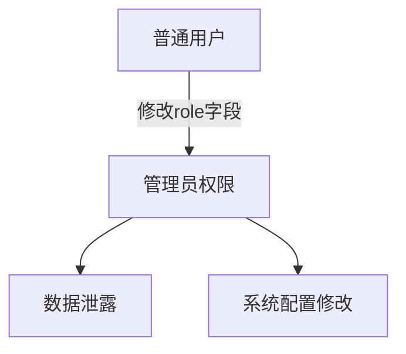

# 批量分配漏洞（Mass Assignment）基本概念详解

## 一、漏洞定义与核心特征
批量分配漏洞（Mass Assignment）是一种因Web应用程序自动化数据绑定机制设计缺陷导致的安全漏洞。该漏洞允许攻击者通过HTTP请求（如POST/PUT）向服务器发送预期外的参数，强制修改应用程序对象中本应受保护的属性。

核心特征：
- 依赖框架自动绑定机制（如Spring MVC的@ModelAttribute、Rails的ActiveRecord）
- 参数与对象属性直接映射，缺乏显式过滤
- 利用请求参数的键值对覆盖后端数据模型

## 二、漏洞原理深度解析
### 1. 自动化数据绑定的双刃剑
现代Web框架（如Ruby on Rails、Laravel、Spring Boot）为实现快速开发，提供自动化参数绑定功能。例如：
```ruby
# Ruby on Rails典型危险写法
@user.update(params[:user])
```
此代码会将所有传入的user参数直接映射到User模型属性，包括`is_admin`等敏感字段。

### 2. 关键缺陷形成路径
漏洞产生遵循以下模式：
```
客户端构造非常规参数 → 框架自动绑定 → 服务端未验证 → 数据库非预期写入
```
典型示例请求：
```http
POST /users HTTP/1.1
Content-Type: application/json

{
  "username": "attacker",
  "email": "attacker@example.com",
  "role": "admin",  // 恶意添加特权字段
  "account_balance": 1000000
}
```

### 3. 核心攻击面
- **未过滤的CRUD操作**：Create/Update操作未使用允许字段白名单
- **嵌套对象处理**：`user[profile][social_score]`类嵌套参数
- **元数据字段**：`created_at`、`version`等系统维护字段

## 三、漏洞类型分类
### 1. 按攻击目标分类
| 类型                | 特征描述                          | 示例场景                     |
|---------------------|-----------------------------------|------------------------------|
| 权限提升型          | 修改角色标识字段                  | role=admin, is_superuser=1  |
| 数据篡改型          | 覆盖业务敏感字段                  | balance=9999, credit_limit=0|
| 逻辑破坏型          | 修改状态机或版本控制字段          | status=approved, version=99 |
| 关联劫持型          | 篡改外键关联关系                  | owner_id=123, department=7  |

### 2. 按参数结构分类
- **平面参数攻击**：直接修改一级属性
  ```http
  POST /users
  name=Alice&membership_level=5
  ```
  
- **嵌套参数攻击**：利用JSON/XML的层次结构
  ```json
  {
    "user": {
      "profile": {
        "security_level": "high"
      }
    }
  }
  ```

- **元数据攻击**：修改系统保留字段
  ```http
  PUT /orders/123
  created_at=2020-01-01&_version=0
  ```

## 四、危害影响分析
### 1. 纵向权限突破


### 2. 业务逻辑破坏
- 订单系统：`total_price=0.01`
- 金融系统：`credit_limit=9999999`
- 审批系统：`approval_status=approved`

### 3. 数据完整性损毁
- 用户资料：`social_security_number=伪造值`
- 医疗记录：`diagnosis_result=任意修改`
- 审计日志：`operation_time=历史时间`

### 4. 关联关系劫持
```python
# 修改外键导致数据归属变更
Project.update({ "owner_id": 666 }) 
```

## 五、典型攻击模式
### 1. 黑盒探测方法
- 参数模糊测试：使用`_method`、`X-HTTP-Method-Override`探测
- 字段枚举攻击：通过错误信息推断可用字段名
- 版本回滚攻击：修改`version`字段绕过乐观锁

### 2. 白盒利用模式
```javascript
// 危险的反序列化模式
const user = Object.assign(new User(), req.body);
```

### 3. 高级绕过技术
- 大小写变形：`IsAdmin` vs `isadmin`
- 前缀注入：`_user_role`
- Content-Type攻击：`application/xml` vs `application/json`

## 六、防御范式
### 1. 输入验证黄金法则
```java
// Spring Boot安全写法示例
@PutMapping("/users/{id}")
public User updateUser(@Valid @ModelAttribute("user") User user, 
                      BindingResult result,
                      @RequestParam("allowedFields") Set<String> fields) {
    // 显式指定允许字段
    DataBinder dataBinder = new DataBinder(user);
    dataBinder.setAllowedFields(fields);
}
```

### 2. 分层防护策略
| 防护层级       | 具体措施                          |
|----------------|-----------------------------------|
| 框架层         | 启用strict模式，禁用自动绑定       |
| 业务层         | 使用DTO模式进行字段过滤           |
| 持久层         | 审计Hibernate事件监听器           |
| 监控层         | 记录非常规参数访问日志            |

### 3. 安全开发实践
- 字段白名单制度：使用@Column(updatable = false)注解
- 敏感字段隔离：将特权字段存放在独立实体中
- 自动化检测：集成SpotBugs规则`MS_MASS_ASSIGNMENT`

本文档深入剖析了批量分配漏洞的核心机理与攻击形态，为后续的漏洞检测、防御方案设计提供了理论基础。实际防护需要结合框架特性进行深度安全配置，建议在SDL流程中建立参数白名单审核机制。

---

*文档生成时间: 2025-03-13 13:52:59*
