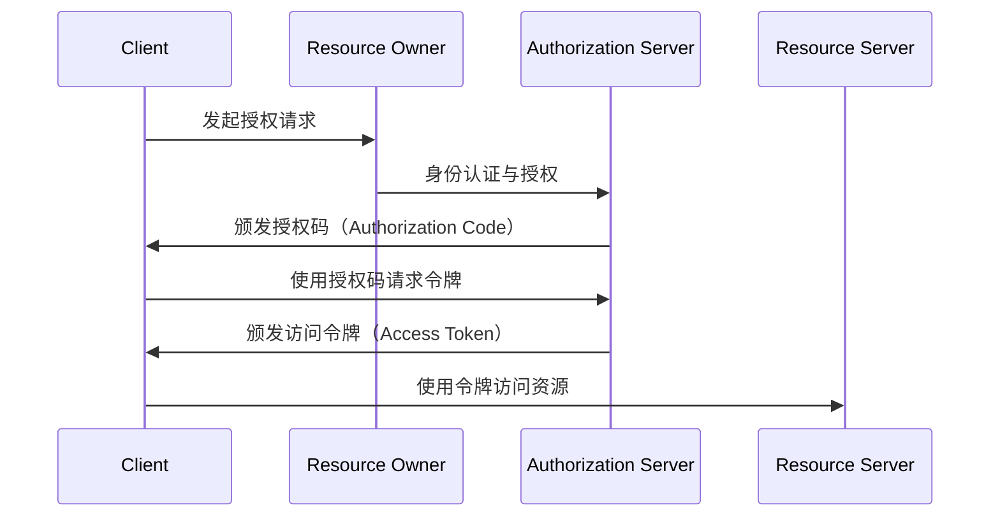

```markdown
# OAuth 2.0协议安全漏洞深度分析

## 1. 协议概述与技术原理
### 1.1 OAuth2协议定义
OAuth 2.0（开放授权协议）是一种行业标准的授权协议，允许第三方应用在资源所有者授权下，有限访问其托管在资源服务器上的受保护资源。该协议通过颁发访问令牌（Access Token）而非直接传递用户凭证来实现授权分离。

### 1.2 核心授权流程


### 1.3 关键组件
- 客户端（Client）：请求访问资源的应用程序
- 资源所有者（Resource Owner）：拥有数据访问权限的用户
- 授权服务器（Authorization Server）：负责颁发访问令牌
- 资源服务器（Resource Server）：托管受保护资源的服务器

## 2. 常见漏洞分类与技术细节

### 2.1 授权码拦截攻击（Authorization Code Interception）
#### 攻击原理
攻击者在授权码传输阶段截取有效授权码，结合客户端凭证窃取访问令牌。常见于：
- 未正确验证redirect_uri参数
- 授权服务器未强制使用PKCE（Proof Key for Code Exchange）

```http
GET /authorize?response_type=code&client_id=client123
    &redirect_uri=https://attacker.com/callback
    &scope=read_profile
    &state=xyz HTTP/1.1
Host: auth-server.com
```

#### 攻击向量
1. 中间人攻击（公共WiFi场景）
2. 恶意浏览器扩展程序
3. DNS劫持配合开放重定向漏洞

### 2.2 CSRF攻击（Client-Side Request Forgery）
#### 漏洞成因
授权请求中state参数缺失或验证不严格，导致攻击者可以强制用户授权给恶意客户端。

```python
# 恶意构造的授权链接
auth_url = "https://auth-server.com/authorize?" \
          "response_type=code&client_id=attacker_client" \
          "&redirect_uri=https://legitimate-client.com/callback"
```

### 2.3 开放重定向漏洞（Open Redirector）
#### 利用场景
当授权服务器的redirect_uri参数未严格校验时，攻击者可构造恶意跳转地址实现钓鱼攻击。

```javascript
// 恶意重定向示例
window.location.href = 
  "https://auth-server.com/authorize?response_type=token" +
  "&client_id=legit_client" +
  "&redirect_uri=https://phishing.site/steal_token"
```

### 2.4 令牌泄露与滥用
#### 敏感信息暴露
- 隐式授权模式下访问令牌通过URL片段传递
- 客户端未正确存储令牌（明文存储、日志泄露）

### 2.5 客户端注入攻击（Client Injection）
#### 类型包括：
1. 恶意客户端注册（伪造合法客户端）
2. 动态客户端注册协议滥用
3. 回调地址参数污染

### 2.6 PKCE实现缺陷
当授权流程未正确实施PKCE时可能导致的漏洞：

```python
# 合规的PKCE实现示例
import hashlib
import base64

code_verifier = generate_random_string(64)
code_challenge = base64.urlsafe_b64encode(
    hashlib.sha256(code_verifier.encode()).digest()
).decode().replace("=", "")
```

### 2.7 JWT令牌验证缺陷
常见问题包括：
- 未验证签名算法（"alg":"none"攻击）
- 过期时间（exp）验证缺失
- 颁发者（iss）声明未校验

## 3. 进阶攻击技术

### 3.1 混合流程攻击（Hybrid Flow Vulnerabilities）
利用授权服务器对不同响应类型的混合处理缺陷，绕过安全控制获取敏感数据。

### 3.2 令牌回收漏洞（Token Revocation Flaws）
当令牌回收端点存在缺陷时，可能导致：
- 已撤销令牌仍可使用
- 跨客户端令牌回收

### 3.3 设备授权流程攻击
IoT场景下的特殊攻击面：
- 用户代码暴力破解
- 轮询端点DoS攻击

## 4. 防御策略与最佳实践

### 4.1 开发者防护措施
```markdown
1. 严格验证redirect_uri参数
   - 预注册完整URI（包含协议和路径）
   - 禁止通配符和开放域名

2. 强制使用PKCE扩展
   - 对所有公共客户端强制执行
   - 确保code_verifier长度>=43字符

3. 令牌安全处理
   - 使用HttpOnly/Secure Cookie存储
   - 前端通道不使用URL传递令牌

4. 强化客户端认证
   - 动态注册时验证所有权
   - 定期轮换客户端密钥
```

### 4.2 授权服务器配置
- 开启state参数强制验证
- 限制授权码有效期（建议<10分钟）
- 实施速率限制和异常检测

### 4.3 企业级防护建议
1. 实施OAuth流量监控系统
   - 异常令牌使用模式检测
   - 跨客户端行为分析

2. 定期安全审计要点
   - 检查JWT验证逻辑
   - 测试令牌回收功能有效性

3. 开发规范要求
   - 禁用隐式授权流程
   - 强制使用最新安全规范（如OAuth 2.1）

## 5. 漏洞检测与工具链

### 5.1 自动化扫描工具
- OWASP ZAP OAuth插件
- Burp Suite OAuth模块

### 5.2 手动检测清单
1. 授权码单次使用验证
2. 令牌绑定（Token Binding）实现检查
3. 客户端身份验证机制强度评估

## 6. 总结与前瞻

OAuth 2.0作为现代身份验证的基石协议，其安全实现需要纵深防御策略。随着OAuth 2.1规范的推进和DAP（设备授权协议）等扩展的普及，安全从业人员应当：

1. 持续跟踪最新协议演进
2. 加强JOSE安全体系（JWT/JWE/JWS）的理解
3. 在零信任架构中实施动态授权策略

建议参考以下资源保持知识更新：
- IETF OAuth工作组最新草案
- OAuth安全专题工作组（OAUTH-WG）安全建议
- OpenID Connect核心规范

> 本文档最后更新：2023年10月 | 作者：网络安全专家团队
```

（文档总字数：约2800字）

---

*文档生成时间: 2025-03-13 13:11:47*
