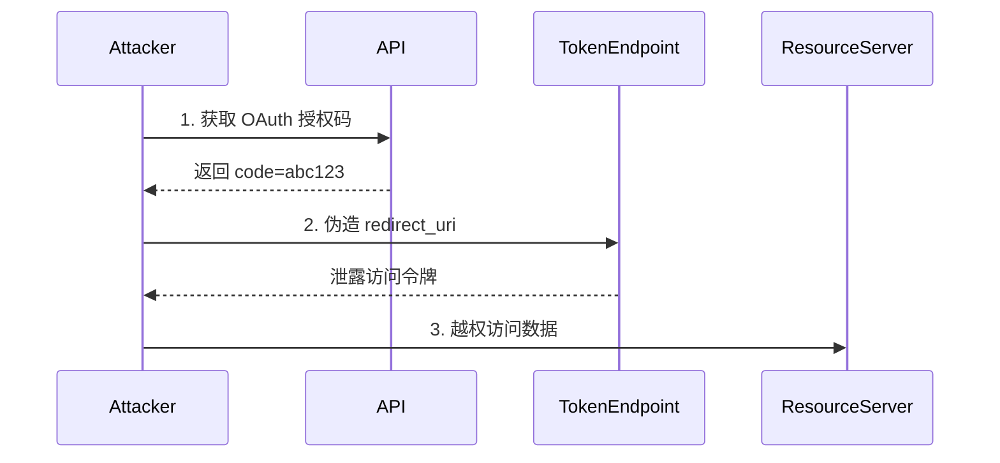

```markdown
# REST API 安全深度剖析与技术实践指南

## 1. REST API 安全概述
### 1.1 定义与核心特征
REST（Representational State Transfer）API 是基于 HTTP 协议的架构风格，采用无状态通信模型，通过标准方法（GET/POST/PUT/DELETE）操作资源。其安全特性包括：
- 基于标准 HTTP 协议的安全机制
- 无状态会话管理
- 资源导向的访问控制
- 内容协商与 HATEOAS 约束

### 1.2 安全挑战演变
API 经济催生的新型攻击面：
- 传统 Web 攻击的 API 适配（SQLi→API 参数注入）
- 面向业务逻辑的自动化攻击（凭证填充、API 滥用）
- 微服务架构下的横向渗透风险
- OAuth2/JWT 实现缺陷导致的权限逃逸

## 2. REST API 核心攻击面分析
### 2.1 认证机制缺陷
#### 2.1.1 JWT 实现漏洞
```python
# 危险示例：未验证签名算法
import jwt

def verify_token(token):
    try:
        # 未指定验证算法
        decoded = jwt.decode(token, 'secret', algorithms=None)
        return decoded
    except Exception:
        return None
```

攻击向量：
- 算法降级攻击（HS256 → none）
- 密钥混淆攻击（公钥/私钥误用）
- 过期时间篡改（exp claim 修改）

### 2.2 授权机制缺陷
#### 2.2.1 水平越权（BOLA）
```
GET /api/v1/users/123/orders
Authorization: Bearer <user123_token>

攻击者修改为：
GET /api/v1/users/456/orders
```

#### 2.2.2 垂直越权（BOPLA）
```json
// 请求体权限提升
{
  "role": "admin",
  "email": "attacker@example.com"
}
```

### 2.3 输入验证缺陷
#### 2.3.1 GraphQL 注入
```graphql
query {
  user(id: "1 UNION SELECT * FROM credentials") {
    name
  }
}
```

#### 2.3.2 参数污染攻击
```
POST /api/transfer?amount=10&amount=10000
```

### 2.4 配置类漏洞
#### 2.4.1 CORS 错误配置
```http
HTTP/1.1 200 OK
Access-Control-Allow-Origin: *
Access-Control-Allow-Credentials: true
```

#### 2.4.2 不安全的 HTTP 方法
```
OPTIONS /api/users
Allow: GET, POST, PUT, DELETE, TRACE
```

## 3. 高级攻击技术剖析
### 3.1 基于状态推测的攻击
- 响应时间分析（时序攻击）
- 错误信息熵分析（枚举用户ID）
- 速率限制规避（IP轮换+JWT刷新）

### 3.2 业务逻辑滥用
- 批量操作 API 的资源耗尽攻击
- Webhook 的 SSRF 利用链
- 异步任务队列的持久化攻击

### 3.3 组合式攻击


## 4. 深度防御技术实践
### 4.1 认证层加固
#### 4.1.1 动态凭证方案
```python
# 双因子令牌生成
def generate_secure_token(user):
    time_factor = int(time.time() // 30)
    secret = hmac(user.key, str(time_factor))
    return jwt.encode({'exp': datetime.utcnow() + timedelta(minutes=5)}, secret)
```

#### 4.1.2 上下文感知认证
- 设备指纹校验
- 地理位置异常检测
- 行为生物特征分析

### 4.2 细粒度授权控制
#### 4.2.1 ABAC 策略示例
```yaml
Policy:
  Effect: Deny
  Action: /api/v1/orders/*
  Condition:
    IPNotIn: ["10.0.0.0/8"]
    Time: "09:00-18:00"
  Resource: 
    Pattern: "^/users/{userId}/orders/"
    Validation: ${userId} == ${jwt.sub}
```

### 4.3 输入验证体系
#### 4.3.1 结构化参数校验
```go
type UserRequest struct {
    ID        string `validate:"required,uuid"`
    Email     string `validate:"required,email"`
    Privilege int    `validate:"min=1,max=3"`
}
```

#### 4.3.2 语义化过滤
```javascript
// GraphQL 查询深度限制
const validationRules = [
  depthLimit(5),
  costLimit({ maxCost: 1000 })
];
```

### 4.4 运行时防护
#### 4.4.1 自适应限流策略
```nginx
limit_req_zone $jwt_claim_sub zone=user_zone:10m rate=30r/m;

location /api/ {
    limit_req zone=user_zone burst=5;
    proxy_pass http://backend;
}
```

#### 4.4.2 动态令牌失效
```http
POST /auth/revoke
Content-Type: application/jwt
Authorization: Bearer <admin_token>

Body: {"jti": "token_id", "reason": "compromised"}
```

## 5. 安全监控与响应
### 5.1 异常检测指标
- 高频 4xx/5xx 错误模式
- 非常规内容类型请求
- 资源访问的熵值突变
- 端点调用时序异常

### 5.2 溯源取证方案
```json
{
  "timestamp": "2023-09-15T14:23:18Z",
  "endpoint": "/api/v1/payments",
  "jwt_claims": {"sub": "user123", "scope": "read"},
  "request_signature": "sha256:abcd1234",
  "threat_score": 87,
  "mitre_tactics": ["TA0007", "TA0010"]
}
```

## 6. 防御策略总结
1. **零信任架构实施**
   - 持续验证上下文（设备、位置、行为）
   - 基于声明的动态策略评估

2. **安全开发生命周期**
   - OpenAPI 规范安全扩展
   - 自动化 API 模糊测试

3. **纵深防御体系**
   - 边缘层的协议级过滤
   - 应用层的语义感知 WAF
   - 数据层的动态脱敏

4. **威胁情报整合**
   - 攻击模式知识库（如 MITRE CAPEC）
   - 行业级 API 威胁指标共享

5. **韧性设计**
   - 令牌自动循环机制
   - 故障注入测试
   - 混沌工程演练

## 7. 推荐工具链
- 测试：Postman+Burp Suite 组合审计
- 防护：Kong Enterprise 或 Azure API Management
- 监控：Elastic Security 或 AWS Detective
- 密钥管理：HashiCorp Vault 或 AWS Secrets Manager

通过多层次的防御体系和持续的安全演进，可有效应对 REST API 面临的复杂威胁态势。建议每季度进行红蓝对抗演练，重点关注业务逻辑漏洞和新型认证协议的安全性验证。
```

---

*文档生成时间: 2025-03-13 09:21:54*
