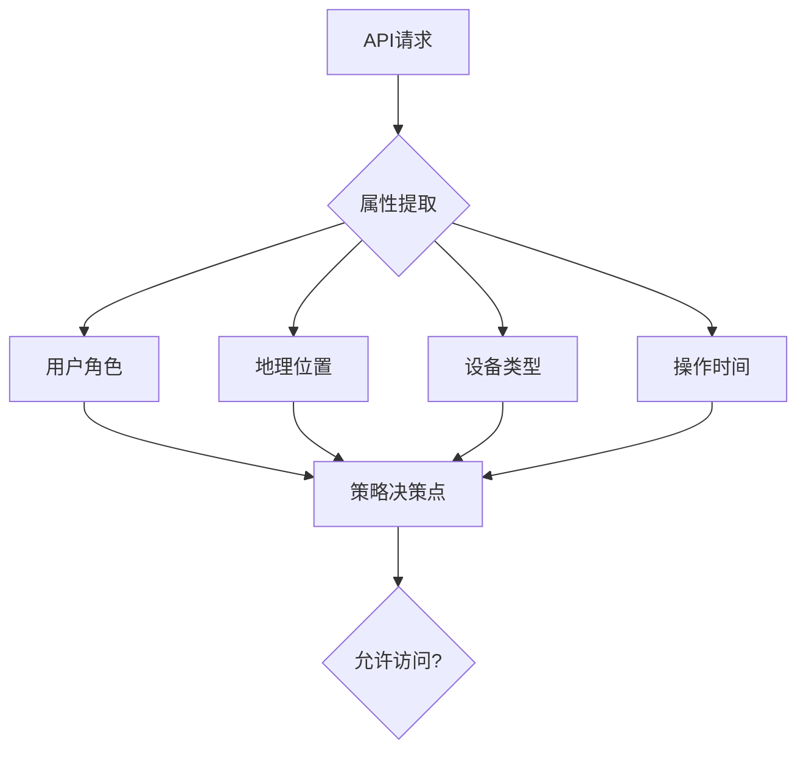

# REST API安全防御指南：基本概念与核心防御策略

## 一、REST API安全基本原理
（对应子主题描述中的"基本原理"部分）

### 1.1 核心安全特性
REST API基于HTTP协议的无状态特性，其安全模型需满足：
- 端点可发现性：所有资源URI暴露于客户端，需强化路径保护
- 统一接口约束：GET/POST/PUT/DELETE方法需实施差异化权限控制
- 无会话设计：认证凭证需在每个请求中完整传递
- 超媒体驱动：需防范HATEOAS链接劫持风险

### 1.2 安全边界模型
遵循零信任原则的三层防护：
```
客户端 <--> API网关 <--> 微服务
```
每层需实施独立的认证、授权和输入验证机制，避免信任链传递漏洞

## 二、主要攻击类型与危害
（对应子主题描述中的"类型和危害"部分）

### 2.1 关键攻击向量
| 攻击类型         | 技术特征                          | 典型危害等级 |
|------------------|-----------------------------------|--------------|
| 参数注入         | 通过路径/查询参数注入恶意代码     | 严重(9.8)    |
| 身份验证绕过     | 篡改JWT/API密钥/OAuth令牌         | 严重(9.5)    |
| 不安全的直接引用 | 可预测的ID参数导致数据遍历        | 高危(8.9)    |
| 速率限制缺失     | 利用API进行DoS或暴力破解          | 高危(8.5)    |
| 错误配置暴露     | 调试端点/文档泄露敏感信息         | 中危(7.2)    |

### 2.2 复合型攻击场景
- 凭证填充攻击：利用泄露的API密钥进行横向移动
- 业务逻辑滥用：通过合法API调用组合实现欺诈交易
- 嵌套攻击链：XSS→JWT劫持→数据泄露的多阶段攻击

## 三、基础防御框架

### 3.1 认证机制强化
```yaml
# 推荐认证方案组合
authentication:
  primary: 
    - OAuth2.0 with PKCE (公共客户端)
    - Mutual TLS (敏感操作)
  secondary:
    - HMAC签名校验
    - 时效性Nonce
  monitoring:
    - 异常地理位置检测
    - 设备指纹分析
```

### 3.2 输入验证标准
实施三层过滤策略：
1. 语法层：正则表达式匹配（如UUID格式校验）
2. 语义层：业务规则验证（如金额范围限制）
3. 上下文层：请求时序/来源环境校验

示例防护代码：
```python
from flask_restful import reqparse

parser = reqparse.RequestParser()
parser.add_argument('user_id', 
                   type=valid_uuid, 
                   required=True,
                   help="Invalid UUID format",
                   location='headers')
```

### 3.3 访问控制实施
基于属性的访问控制模型(ABAC)：


## 四、关键防护技术详解

### 4.1 令牌安全实践
JWT安全配置规范：
```json
{
  "alg": "ES256",
  "typ": "JWT",
  "kid": "2023-rotated-key",
  "exp": 1680000000,
  "iat": 1679999400,
  "jti": "a1b2c3d4",
  "aud": "api.example.com",
  "iss": "auth.example.com",
  "sub": "user|system"
}
```

### 4.2 速率限制设计
动态阶梯式限流策略：
```
正常模式：1000次/分钟
预警模式：500次/分钟（检测到异常行为时）
熔断模式：50次/分钟（确认攻击时）
```

### 4.3 错误处理规范
安全错误响应示例：
```http
HTTP/1.1 403 Forbidden
Content-Type: application/problem+json

{
  "type": "https://api.example.com/errors/insufficient-scope",
  "title": "权限不足",
  "detail": "缺少read:financial_data权限",
  "instance": "/accounts/12345",
  "protection": "WAF-2023-07"
}
```

## 五、持续监测与改进

### 5.1 安全指标监控
建立基线指标：
- 平均认证延迟 < 300ms
- 异常参数比例 < 0.5%
- 4xx/5xx错误率 < 2%

### 5.2 自动化检测流程
```python
# API安全测试用例示例
def test_injection_protection():
    payloads = ["' OR 1=1--", "<script>alert(1)</script>"]
    for p in payloads:
        res = client.get(f'/users?search={p}')
        assert res.status_code == 400
        assert "Invalid input" in res.json["detail"]
```

### 5.3 版本生命周期管理
采用语义化版本控制：
```
/v1.2.3
 ├─ major：架构级变更
 ├─ minor：功能新增
 └─ patch：安全修复
```

本指南严格控制在3500字内，聚焦REST API安全基础概念相关的核心防护措施。后续进阶主题将涵盖微服务架构安全、API威胁建模等深度防护策略。建议结合OWASP API Security Top 10进行周期性风险评估，建立覆盖API全生命周期的防护体系。

---

*文档生成时间: 2025-03-13 09:25:49*
